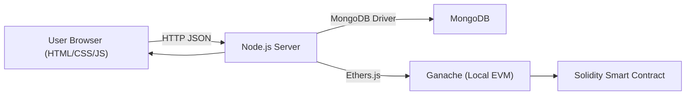
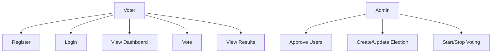
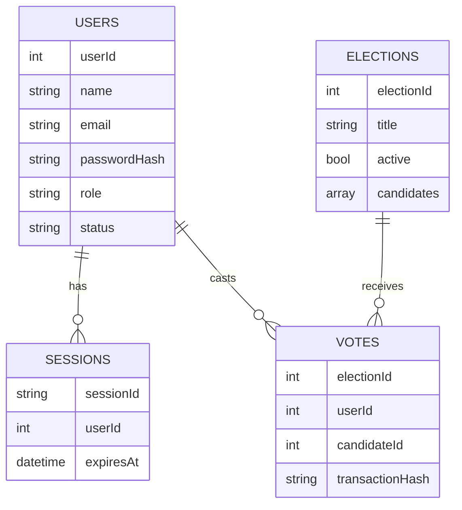
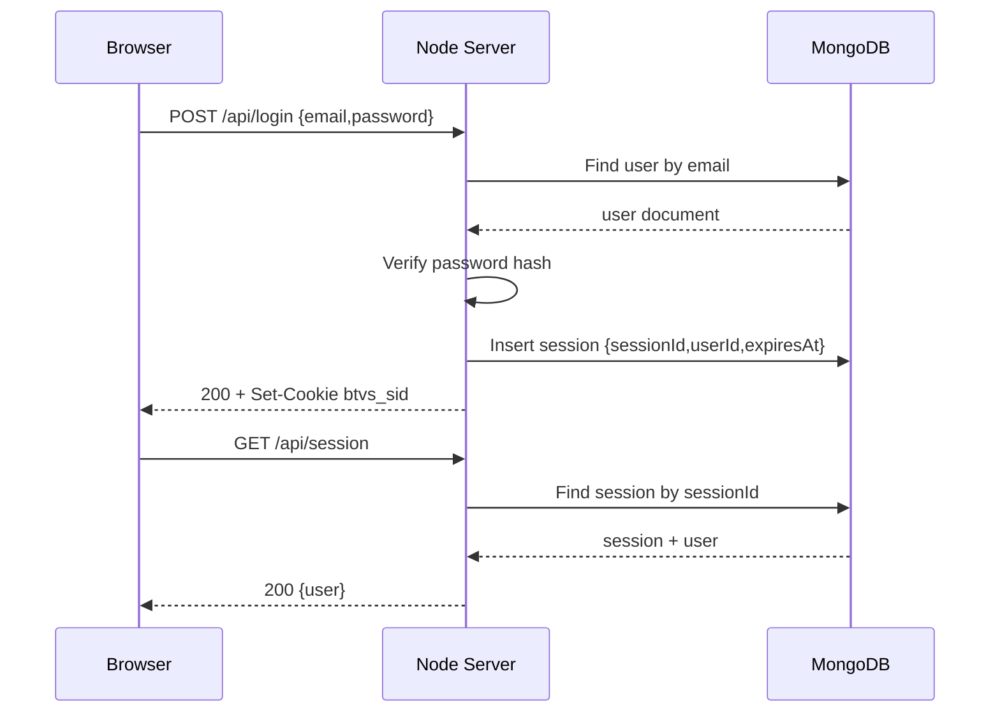
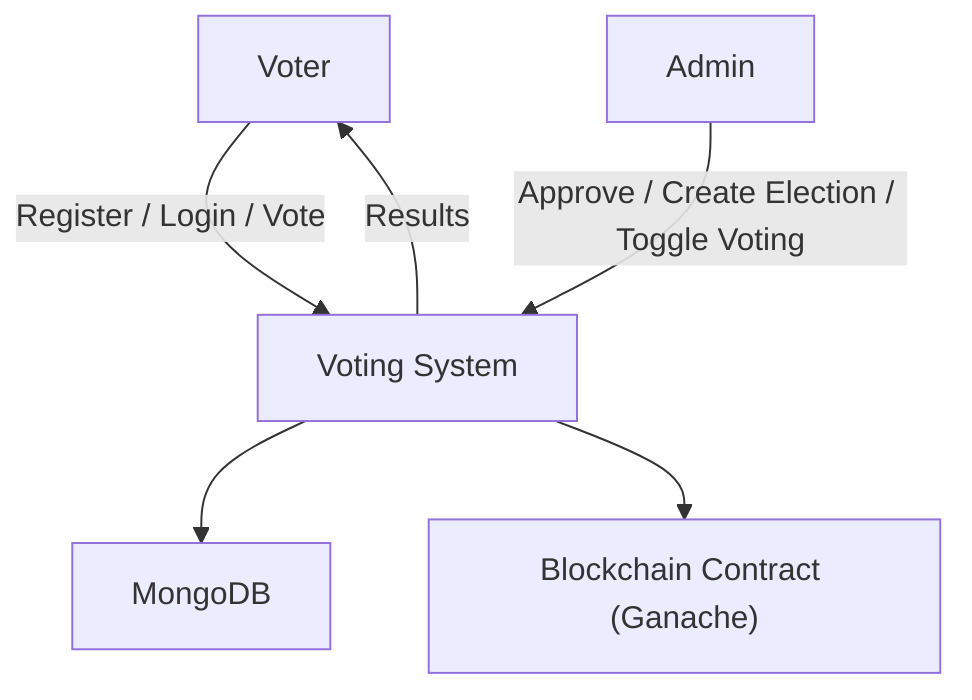
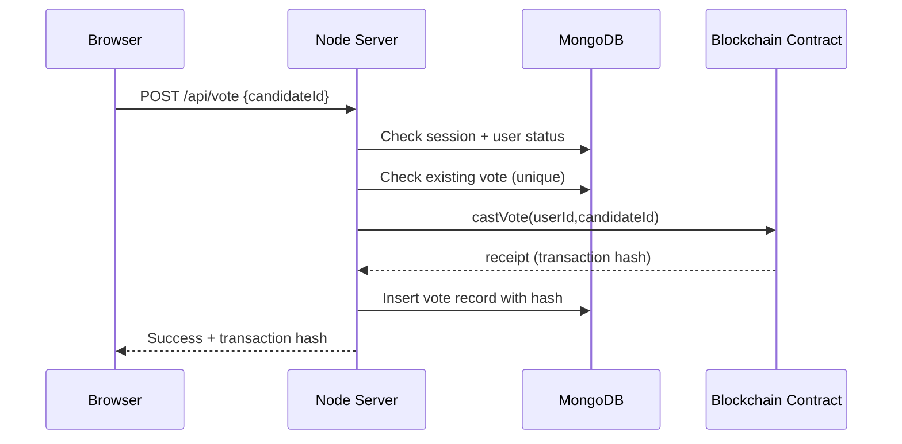
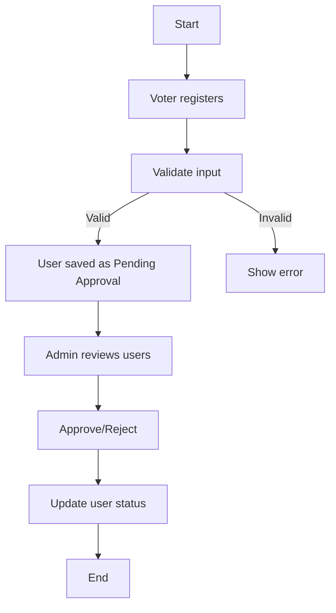
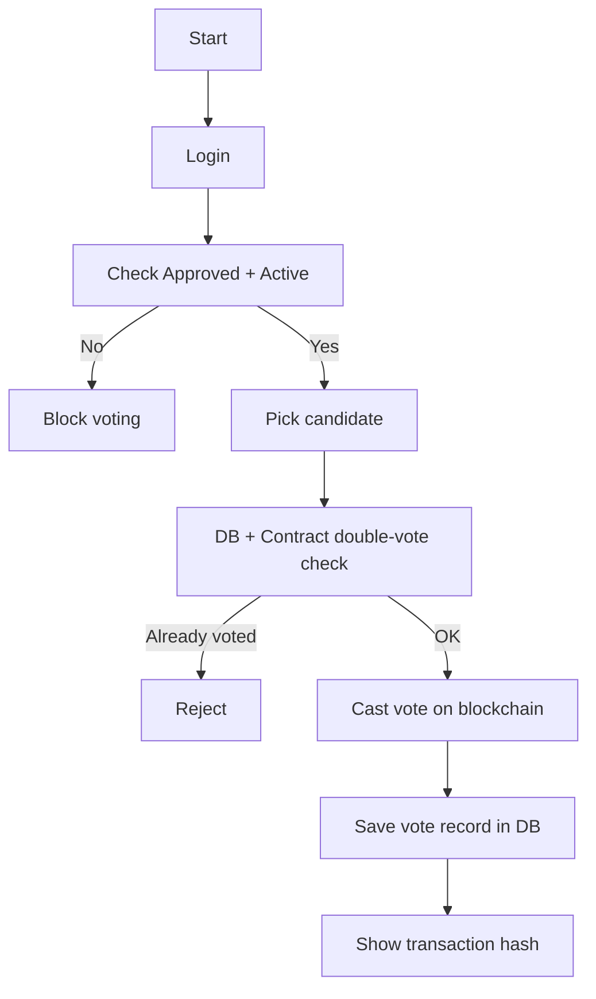
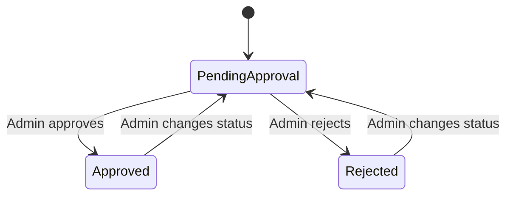

Kathmandu, Nepal

# Project Documentation

## Contents

(This Table of Contents is auto-generated in the `.docx`. In MS Word, right click the TOC and choose “Update Field”.)

---

## Abstract

This project is a prototype of a **Blockchain Transparent Voting System** designed mainly for a college or small organization election. The main goal is to make voting more **transparent**, to reduce confusion in counting, and to enforce **one-person-one-vote** in a simple and understandable way.

The system uses a hybrid design:

- **MongoDB (Database):** stores users, login sessions, election backup data, and vote records.
- **Local Blockchain (Ganache EVM):** runs on the same machine and behaves like an Ethereum network for demonstration.
- **Solidity Smart Contract:** stores election configuration and vote counts. It also produces a real transaction hash for each important action (create election, start/stop election, vote).

The normal flow of the system is:

1. Voter registers with name, email, and password.
2. Admin reviews new registrations and approves eligible voters.
3. Approved voters login and view the election dashboard.
4. When voting is active, the voter selects exactly one candidate and casts the vote.
5. The vote is recorded in the blockchain smart contract and the voter receives a transaction hash.
6. The results page shows total votes and candidate vote counts in an easy format.

This project is a final-year project style prototype, so it is designed for local demonstration and learning. It does not aim to replace real national election systems. Real elections require stronger privacy, identity verification, and security hardening. Still, this project clearly demonstrates how a database and a blockchain contract can work together to provide a simple voting flow with a transparent counting demonstration.

**Keywords:** E-Voting, Blockchain, Transparency, Smart Contract, MongoDB, Node.js, Ganache

---

## ACKNOWLEDGEMENT

I would like to express my sincere gratitude to my supervisor **[Supervisor Name]** for guidance, suggestions, and continuous support throughout this project. I also thank my teachers for providing knowledge and learning support. I am grateful to my friends and family for their encouragement during development, testing, and documentation.

---

## Preface

This report explains the background, analysis, and design of the **Blockchain Transparent Voting System**. It is written in simple language, following an academic project documentation format. The report includes the problem, objectives, scope, literature review, system analysis and design, Agile-based implementation plan, and expected outcomes and limitations.

The project is built using:

- Node.js backend with API endpoints
- MongoDB database with indexes for integrity
- Solidity smart contract deployed to a local Ganache blockchain
- HTML/CSS/JavaScript frontend for user pages

This report also provides tables and figures related to requirements, database design, system architecture, and voting flow.

---

## Declaration

I hereby declare that this project and this documentation are my original work completed under the guidance of **[Supervisor Name]**. Any external ideas or sources used in the project are properly acknowledged.

**Name:** [Your Name]  
**Signature:** _____________________  
**Date:** [YYYY-MM-DD]

---

## Certificate From Supervisor

This is to certify that **[Your Name]** has successfully completed the project titled **“Blockchain Transparent Voting System”** under my supervision and has submitted this documentation for evaluation.

**Supervisor:** [Supervisor Name]  
**Signature:** _____________________  
**Date:** [YYYY-MM-DD]

---

## LIST OF FIGURES

(This List of Figures is generated automatically from the “Figure …” captions in this report.)

---

## LIST OF TABLES

(This List of Tables is generated automatically from the “Table …” captions in this report.)

---

## Abbreviation

- API: Application Programming Interface  
- DB: Database  
- DFD: Data Flow Diagram  
- EVM: Ethereum Virtual Machine  
- HTTP: Hypertext Transfer Protocol  
- JSON: JavaScript Object Notation  
- UI: User Interface  

---

## 1. INTRODUCTION

### 1.1 Background of the Study

Voting is a process where people choose a representative or make a decision by selecting an option. In many places, paper-based voting is still used. Paper voting is simple and familiar, but it is slow to manage and counting can take a long time. Also, when results are announced, some people may not fully trust the counting process because it is hard to prove the counting was done correctly.

Digital voting can make voting faster and more convenient. However, digital voting systems create other problems. Users may worry about security, double voting, and whether the results can be changed by someone who controls the server. If a voting system is fully centralized, people must trust the organization and the server administrators completely.

Blockchain technology is often discussed in voting because it is based on a ledger concept. A ledger records events in a way that is hard to modify silently. In a blockchain, changes are recorded as transactions, and each transaction can be identified by a unique hash. This can help demonstrate transparency in vote counting because the system can show transaction proofs and the stored election state in the smart contract.

In this project, the goal is not to build a full national election solution. The goal is to build a clear academic prototype that demonstrates:

- user registration and approval
- one vote per voter
- transparent election configuration and vote counting using a blockchain smart contract
- clear result display for easy understanding

### 1.2 Problem Statement

In small elections like college student council elections, common problems are:

- No easy way to prove that results were not changed after counting.
- Some users may try to vote more than one time.
- Many systems do not have a clear approval process to ensure only eligible voters can vote.
- Users may not trust a single centralized server completely.

So, we need a simple voting system that:

- controls eligibility through admin approval,
- prevents double voting,
- demonstrates transparent counting using blockchain transactions,
- provides clear and easy pages for users and admin.

### 1.3 Objectives of the Project

Table: Project Objectives

| Objective | Description |
|---|---|
| Transparent election configuration | Store election title and candidate list on blockchain contract |
| Transparent counting | Store vote counts on blockchain contract |
| One-person-one-vote | Prevent a voter from voting more than once |
| Admin approval workflow | Ensure only approved voters can vote |
| Simple, usable UI | Provide pages for login, register, dashboard, vote, results, admin |
| Local demo readiness | Run locally using MongoDB and Ganache for stable demonstration |

### 1.4 Scope of the Project

The scope of this prototype includes:

- registration of voters
- admin approval or rejection of voters
- creation and updating of one election by admin
- starting and stopping voting by admin
- one-time voting by approved voters
- storing vote transaction hash after voting
- displaying results (total votes and votes per candidate)

The scope does not include:

- biometric or national ID verification
- advanced privacy-preserving vote encryption
- large-scale deployment to public networks
- integration with SMS/email OTP systems

### 1.5 Significance of the Project

This project is important for learning and demonstration because:

- it shows how to build real login/session functionality in a secure way (password hashing + sessions)
- it shows how database rules (indexes) can enforce integrity like unique voting
- it demonstrates blockchain integration in a simple way using Ganache and a smart contract
- it provides a complete end-to-end flow that can be shown in a presentation (register → approve → vote → transaction hash → results)

---

## 2. LITERATURE REVIEW

### 2.1 Review of Existing Systems / Products

Voting systems can be categorized into different types. Each type has strengths and weaknesses.

**Paper-based voting systems** are common because they are simple and familiar. They do not have hacking risk in the digital sense, but they can still have risks like:

- ballot box tampering
- counting mistakes
- slow result publication
- high human resource requirements

**Centralized electronic voting systems** store all data in one central server and database. These systems can be fast and convenient, but they depend heavily on trust in the server:

- if the server is compromised, results can be changed
- if administrators misuse access, results can be manipulated
- audit is difficult if logs can be edited

Still, centralized systems are widely used for small internal voting because they are easier to build and manage.

**Blockchain-based voting prototypes** try to reduce the trust on a single server by storing some election information on a blockchain ledger. Common ideas include:

- storing vote counts on chain
- storing votes as transactions
- using smart contracts for election logic

However, blockchain voting can become complex in real use because of:

- wallet and key management problems for users
- network and gas cost issues in public blockchains
- privacy challenges (how to keep vote choice private)

For this reason, many academic projects use a hybrid approach where the database handles identity and sessions while blockchain is used for transparency demonstration of election state and counting.

Important ideas from related systems that are useful for this project:

- **Eligibility:** only eligible people should be allowed to vote.
- **Uniqueness:** one person should not be able to vote more than one time.
- **Integrity:** the counting should not be changeable silently.
- **Auditability:** the system should provide proof or logs for review.
- **Usability:** the process should be simple and understandable.

In real-world voting, privacy is one of the hardest problems. Privacy means the system should not reveal a voter’s choice and should protect voters from pressure or coercion. Strong privacy often needs advanced cryptography and very careful design. Because this is a final-year prototype, this project focuses more on transparency demonstration and correctness rather than full privacy.

Blockchain voting systems are usually designed in one of these ways:

1. **Public blockchain voting:** voters vote using wallets. This improves transparency but makes the user experience difficult and introduces gas fees and network delays.
2. **Permissioned blockchain voting:** selected nodes run the network. This is easier to control but still requires trust in the operators.
3. **Hybrid voting:** a database manages users and login while a blockchain smart contract manages election configuration and counting.

This project uses the hybrid model because it is practical for academic demonstration and avoids public network issues (internet dependency, gas cost, and unpredictable delays).

Another important topic in literature is the **trust model**. In any voting system, we must define who is trusted:

- In a centralized system, the server is trusted for everything.
- In a public blockchain system, the blockchain network provides transparency, but users must manage keys and the system must handle privacy.
- In a hybrid system like this project, the database is trusted for user identity and sessions, while the blockchain contract is trusted for election configuration and vote counting.

For a student prototype, it is acceptable to trust the admin and server more than a real national election system. The main purpose is to demonstrate concepts clearly and to show how rules can be enforced in both a database and a smart contract.

Most voting literature also mentions that a good system should:

- be easy to use (simple UI, clear steps)
- provide clear error messages (already voted, not approved, election closed)
- keep data consistent (avoid mismatch between UI and stored data)
- provide some audit proof (transaction hashes, readable contract state)

This is why the project shows a transaction hash after voting. Even though the blockchain is local, it still demonstrates a real blockchain transaction flow.

In addition to voting-specific studies, normal web security practices are also important. Most systems need:

- password hashing
- secure sessions
- validation of user input
- protection from repeated actions like double voting

### 2.2 Comparative Analysis

Table: Comparison of Voting Approaches

| Approach | Strengths | Weaknesses |
|---|---|---|
| Paper-based | Familiar, simple, no digital hacking | Slow counting, manual errors, high resources |
| Centralized e-voting | Fast, easy UI, easy reporting | Must trust server completely |
| Blockchain-only | Strong audit trail | Complex for users, privacy hard, cost on public chain |
| Hybrid (DB + blockchain) | Practical flow + transparency demo | Prototype still needs trusted admin/server |

In a student project, the hybrid model is often the best because it provides:

- a usable system like centralized web apps
- extra transparency demonstration via transaction hashes and contract state
- easier setup and stable demo (especially using local Ganache blockchain)

### 2.3 Research Gap / Innovation Justification

Many student projects focus on either:

- web + database voting systems (fast to build but less transparency), or
- only blockchain voting contract (transparent but not a complete usable product)

The gap is that users and evaluators want a complete system that demonstrates both:

- real application flow (registration, approval, voting, results)
- blockchain transparency elements (transaction hash proof, contract-based counting)

This project fills that gap by building a full flow:

- MongoDB stores users and sessions (practical requirement)
- a smart contract stores election state and vote counts (transparency demonstration)
- the UI displays transaction hashes and results in readable form

---

## 3. SYSTEM ANALYSIS AND DESIGN

### 3.1 Feasibility Study

Table: Feasibility Study Summary

| Type | Notes |
|---|---|
| Technical | Node.js + MongoDB + Ganache + Solidity is feasible for a prototype |
| Economic | Low cost because all tools can run locally |
| Operational | Easy operations with admin/voter roles |
| Schedule | Modular design fits academic timelines |

Feasibility explanation:

- **Technical feasibility:** The project uses common web technologies and a local blockchain network. Ganache makes blockchain development easier for demos.
- **Economic feasibility:** No paid cloud services are needed for the prototype. It runs on a normal laptop.
- **Operational feasibility:** Admin control and simple pages make it easy to operate in a college environment.
- **Schedule feasibility:** The project can be built in iterations: auth first, admin approval, election management, voting, results, then blockchain integration.

### 3.2 Requirements Specification

Table: Functional Requirements

| ID | Requirement |
|---|---|
| FR-1 | Voter can register with name, email, and password |
| FR-2 | Admin can approve/reject/pending a voter |
| FR-3 | User can login/logout using sessions |
| FR-4 | Admin can create/update election title and candidates |
| FR-5 | Admin can start/stop voting |
| FR-6 | Approved voter can vote exactly once |
| FR-7 | Results page shows vote totals and candidate counts |
| FR-8 | Vote response shows blockchain transaction hash |

Functional requirement explanation:

- Registration should store the user as “Pending Approval” so admin can check eligibility.
- Only approved users can vote. Pending or rejected users cannot vote.
- Voting must be active to cast a vote. If voting is closed, the vote request is rejected.
- The system must block double voting both in DB and in blockchain logic.

Table: Non-Functional Requirements

| Category | Requirement |
|---|---|
| Security | Password hashing, role checks, HttpOnly session cookie |
| Reliability | Unique indexes prevent duplicate email and duplicate vote |
| Usability | Simple pages, clear messages, readable results |
| Maintainability | Code split into auth/validation/blockchain modules |
| Performance | Works smoothly for small elections |

Non-functional requirement explanation:

- Passwords should never be stored in plain text. Hashing is required.
- Sessions should be stored securely server-side, not in local storage.
- The system must show user-friendly errors like “already voted” or “not approved”.
- MongoDB indexes should protect the rules even if API is called multiple times.

### 3.3 System Design

This section explains how the system is designed. The goal is to make the design easy to understand and easy to present.

Figure: System Architecture (Client–Server–DB–Blockchain)



**Explanation (Architecture):**

- The browser loads HTML/CSS/JS pages from the server.
- The browser calls API endpoints (JSON).
- The server validates inputs and checks session/user status.
- MongoDB stores users, sessions, elections backup, and votes.
- Ganache provides a local blockchain network.
- The Solidity smart contract stores election state and vote counts.

Figure: Use Case Diagram (Voter/Admin)



**Database design (MongoDB collections):**

Table: Database Collections (Schema Summary)

| Collection | Purpose |
|---|---|
| `users` | Store admin/voter accounts and approval status |
| `sessions` | Store login sessions with expiry |
| `elections` | Store election backup data (title, active, candidates) |
| `votes` | Store who voted, for which candidate, and tx hash |

Table: Users Collection Fields

| Field | Type | Notes |
|---|---|---|
| `userId` | Number | Unique number for each user |
| `name` | String | Full name |
| `email` | String | Unique and normalized |
| `passwordHash` | String | Hashed password (scrypt format) |
| `role` | String | `admin` or `voter` |
| `status` | String | `Approved`, `Pending Approval`, `Rejected` |

Table: Elections Collection Fields

| Field | Type | Notes |
|---|---|---|
| `electionId` | Number | Single election id used for prototype |
| `title` | String | Election title |
| `active` | Boolean | Voting open/closed |
| `candidates` | Array | Candidate list with ids, names, parties |
| `createdAt` | String | ISO timestamp |
| `updatedAt` | String | ISO timestamp |

Table: Votes Collection Fields

| Field | Type | Notes |
|---|---|---|
| `electionId` | Number | Reference to election |
| `userId` | Number | Reference to voter |
| `candidateId` | Number | Chosen candidate |
| `transactionHash` | String | Blockchain tx hash after voting |
| `createdAt` | String | ISO timestamp |

Table: Sessions Collection Fields

| Field | Type | Notes |
|---|---|---|
| `sessionId` | String | Random session id |
| `userId` | Number | Linked user |
| `createdAt` | String | ISO timestamp |
| `expiresAt` | Date | Expiry time (TTL index) |

Figure: ER Diagram (MongoDB Collections)



**Blockchain smart contract design (simple explanation):**

The smart contract stores:

- election title
- election active/closed status
- candidate list and vote counts
- “has voted” tracking for each voter id (one vote per election configuration)

Why blockchain is used here:

- it provides transaction hashes that help show transparency
- it stores vote count state in a tamper-resistant way for demonstration

**API design (summary):**

Table: API Endpoints Summary

| Method | Endpoint | Role | Purpose |
|---|---|---|---|
| POST | `/api/register` | Guest | Register voter |
| POST | `/api/login` | Guest | Login + create session |
| POST | `/api/logout` | User | Logout |
| GET | `/api/dashboard` | User | Dashboard data |
| GET | `/api/election` | User | Election + eligibility |
| POST | `/api/vote` | Approved voter | Cast vote once |
| GET | `/api/results` | Public | Results data |
| GET | `/api/admin/users` | Admin | List users |
| POST | `/api/admin/users/:id/status` | Admin | Update user status |
| POST | `/api/admin/election` | Admin | Create/update election |
| POST | `/api/admin/election/toggle` | Admin | Start/stop voting |

**Input validation rules (summary):**

Table: Validation Rules Summary

| Input | Rule | Reason |
|---|---|---|
| Name | 2–80 chars | Avoid empty/very long name |
| Email | Valid format + lowercase | Consistent login + uniqueness |
| Password | 8–128 chars | Basic strength |
| Election title | 5–120 chars | Meaningful title |
| Candidates | 2–20 | Minimum fairness and manageable list |
| CandidateId | Positive integer | Valid vote |
| Status | Approved/Pending/Rejected | Only allowed states |

To keep the system strong and easy to demonstrate, the design follows common e-voting security properties in a simple way.

Table: E-Voting Security Properties (Simple)

| Property | Meaning (Simple) | How This Project Handles It |
|---|---|---|
| Eligibility | Only allowed voters can vote | Admin approval + login required |
| Uniqueness | One voter can vote once | DB unique index + contract voted check |
| Integrity | Counting should not be changed silently | Vote counts stored in smart contract state |
| Auditability | Actions should be reviewable | Transaction hash shown; contract state readable |
| Availability | System should work during voting | Local demo setup + simple server |

**Database indexes (integrity rules):**

Indexes help enforce important rules even if someone tries to call the API many times quickly.

Table: Database Indexes (Integrity Rules)

| Collection | Index | Purpose |
|---|---|---|
| `users` | unique `email` | Prevent duplicate accounts |
| `users` | unique `userId` | Stable user identity |
| `votes` | unique (`electionId`, `userId`) | Prevent double voting in DB |
| `sessions` | unique `sessionId` | Prevent session collisions |
| `sessions` | TTL `expiresAt` | Auto delete expired sessions |

**Error handling design (simple and clear):**

The system uses clear status codes so the UI can show correct messages.

Table: Error Handling and Status Codes

| Status Code | Meaning | Example |
|---:|---|---|
| 200 | OK | Fetch dashboard, results |
| 201 | Created | Registration success, vote success |
| 400 | Bad Request | Validation failed, invalid JSON |
| 401 | Unauthorized | Not logged in, invalid login |
| 403 | Forbidden | Voter tries admin route, admin tries vote |
| 404 | Not Found | Candidate not found |
| 409 | Conflict | Already voted, email exists |
| 500 | Server Error | Unexpected server error |

**Session design (explained):**

After login, the system creates a random `sessionId` and stores it in MongoDB with an expiry time. The browser stores the session id in an **HttpOnly cookie**. On each request, the server reads the cookie and checks the session in MongoDB. This approach is simple and secure for a prototype because:

- the session token is not stored in local storage
- the token cannot be read by JavaScript due to HttpOnly
- expired sessions are removed automatically by TTL

Figure: Sequence Diagram (Login + Session)



**Election lifecycle design (explained):**

1. Admin creates or updates an election title and candidate list.
2. The server saves this configuration in MongoDB as a backup record.
3. The server calls the smart contract to configure the election on blockchain.
4. Admin starts voting (active = true). The server updates both DB and contract.
5. Voters can vote only when election is active and they are approved.
6. When voting ends, admin toggles it off (active = false).

This flow is simple for demonstration and matches the UI pages in the project.

Figure: Context DFD (High-Level Data Flow)



**Voting flow (sequence):**

Figure: Sequence Diagram (Cast Vote Flow)



**Security design (simple):**

- Passwords are stored as hashes, not plain text.
- Sessions are stored in DB and referenced by HttpOnly cookie.
- Admin routes require admin role.
- DB has unique index to block duplicate voting.
- Smart contract also blocks repeated voting for a voter id.

**UI design (page summary):**

The frontend is kept simple so users can understand the flow quickly during a demo.

- **Login page:** user enters email and password, then logs in.
- **Register page:** new voter creates an account and waits for approval.
- **Dashboard page:** shows user status (Approved/Pending/Rejected) and election status (Open/Closed).
- **Voting page:** shows candidates and allows vote only when user is approved and election is active.
- **Results page:** shows candidate vote counts and total votes.
- **Admin page:** shows user list, approval actions, election creation form, and start/stop voting button.

This UI design reduces confusion because the user always sees:

- their account status
- whether voting is open or closed
- a clear message if they cannot vote

**Authentication methodology (password hashing):**

The system does not store plain passwords. Instead, it stores a hash.

- When a user registers, the password is hashed using **scrypt** with a random salt.
- When the user logs in, the server hashes the provided password again (using the stored salt) and compares it securely.

Why scrypt is used:

- It is designed to be slow and memory-hard, so password cracking becomes more difficult.
- Salt ensures that the same password does not produce the same hash for all users.

**Session methodology (secure login persistence):**

After login, the server creates a session record in MongoDB and sets a cookie:

- Cookie name: `btvs_sid`
- Flags: HttpOnly, SameSite=Lax, Path=/
- Expiry: limited time (TTL)

Why this is important:

- HttpOnly prevents JavaScript from reading the token.
- TTL expiry limits long-term risk.
- Server-side sessions allow invalidation on logout.

**Election management methodology (admin controlled):**

The admin creates an election by providing:

- election title
- candidate list (name and optional party)

The server validates:

- title length is reasonable
- at least 2 candidates exist
- candidate names are not empty

After validation, the server:

1. saves election backup data in MongoDB
2. calls smart contract to configure election (blockchain state becomes the main source of truth for candidates and vote counts)

Admin then starts or stops voting using a toggle. The toggle updates both:

- MongoDB election active flag (for backup and UI)
- smart contract election active flag (for actual voting rules)

**Data consistency methodology (DB + Blockchain):**

The system uses two layers of protection for “one vote per user”:

1. **MongoDB constraint:** unique index on (`electionId`, `userId`) in `votes`.
2. **Smart contract constraint:** `has voted` check for the same voter id in current election.

This is helpful because:

- DB protects application records.
- Contract protects blockchain vote counts.

If a duplicate vote request is sent, at least one layer will block it.

**Failure handling methodology (safe ordering):**

When a vote is cast, the order is important:

1. Call the smart contract vote function.
2. Only if it succeeds, save vote record in MongoDB.

This prevents a situation where DB says “voted” but blockchain vote was never recorded.

**Sample API payloads (for understanding):**

Register request:

```json
{
  "name": "Student One",
  "email": "student1@college.edu",
  "password": "password123"
}
```

Admin create election request:

```json
{
  "title": "Student Council Election 2026",
  "candidates": [
    { "name": "Candidate One", "party": "Union" },
    { "name": "Candidate Two", "party": "Independent" },
    { "name": "Candidate Three", "party": "" }
  ]
}
```

Vote request:

```json
{
  "candidateId": 2
}
```

Vote response:

```json
{
  "message": "Vote recorded successfully.",
  "transactionHash": "0x..."
}
```

**Activity diagram (registration + approval):**



**Activity diagram (voting):**



**User status state diagram:**



**Data lifecycle (simple explanation):**

- User registers → `users` created with Pending Approval
- Admin approves → user status becomes Approved
- User logs in → `sessions` created and cookie set
- User votes → blockchain vote recorded + `votes` inserted
- Results page reads counts and shows them

This completes the system design description for a full demo flow.

---

## 4. IMPLEMENTATION PLAN

### 4.1 Development Methodology

This project is created using **Agile methodology**. Agile means we build the system in small iterations and improve continuously. For a student project, Agile helps because requirements can change during development, and it is easier to show progress.

How Agile was used in this project:

- A backlog of tasks was created (registration, login, admin approval, election create, vote, results, blockchain integration).
- Work was done in small iterations (similar to short sprints).
- After each feature, quick testing was done to confirm it works.
- Bugs and improvements were added in the next iteration.

Agile practices applied:

- **Iteration planning:** decide what to build first (auth first, then voting).
- **Continuous testing:** test after each module.
- **Incremental integration:** connect DB first, then blockchain integration.
- **Continuous improvement:** improve validation messages, refactor code, and update documentation.

Example Agile iteration flow for this project:

1. Build basic UI pages and server route handling.
2. Add MongoDB connection and collections.
3. Add registration + login + sessions.
4. Add admin approval workflow.
5. Add election create/update and toggle.
6. Add voting and results.
7. Add blockchain contract integration and transaction hash display.
8. Test and prepare final documentation.

Agile (Scrum-style) concepts used in this project:

- **Backlog:** list of all tasks/features.
- **Sprint:** a short time box where a small set of tasks are completed.
- **Increment:** working software at the end of each sprint.
- **Review:** show what was built.
- **Retrospective:** discuss improvements for next sprint.

Agile roles (simple for student project):

Table: Agile Roles and Responsibilities

| Role | Responsibility (Simple) |
|---|---|
| Product Owner | Decide what features are needed and priority |
| Scrum Master | Help remove blockers and keep progress smooth |
| Development Team | Build, test, and document the system |

High-level product backlog:

Table: Product Backlog (High Level)

| Priority | Backlog Item |
|---:|---|
| 1 | Basic UI pages and navigation |
| 2 | Registration API + validation |
| 3 | Login/logout + sessions |
| 4 | Admin users list + approval actions |
| 5 | Election create/update + candidate handling |
| 6 | Voting API with one-vote rule |
| 7 | Results API and results UI |
| 8 | Smart contract compile/deploy |
| 9 | Blockchain vote transaction + hash display |
| 10 | Testing and final documentation |

User stories (simple):

Table: User Stories and Acceptance Criteria

| User Story | Acceptance Criteria |
|---|---|
| As a voter, I want to register so I can request voting access. | My account is created and status becomes Pending Approval. |
| As an admin, I want to approve voters so only eligible users can vote. | Admin can set status Approved/Rejected/Pending. |
| As a voter, I want to vote once so the election is fair. | Second vote attempt is blocked. |
| As a voter, I want to see a transaction hash so I can trust the demo. | After voting, transaction hash is shown. |
| As a guest, I want to view results so the process is transparent. | Results show counts and total votes. |

Sprint plan example (for academic timeline):

Table: Sprint Plan (Example)

| Sprint | Goal | Output |
|---:|---|---|
| Sprint 1 | UI + basic server | Pages load, server routes work |
| Sprint 2 | Auth + DB + approval | Register/login works, admin can approve |
| Sprint 3 | Election + voting flow | Election created, one-time vote rule |
| Sprint 4 | Blockchain + final polish | Contract integrated, tx hash shown, report ready |

Definition of Done (DoD) used to decide a task is finished:

Table: Definition of Done (DoD)

| Item | Meaning |
|---|---|
| Works end-to-end | Feature works in UI and API |
| Validation added | Invalid inputs are handled clearly |
| Integrity rules | DB index or contract rule supports correctness |
| Basic testing | Manual test steps done (and unit tests when possible) |
| Document updated | Report updated with tables/figures if needed |

Agile ceremonies used (simple explanation):

- **Sprint planning:** decide which backlog items to complete in the next sprint and what the sprint goal is.
- **Daily stand-up:** short daily check-in: what was done, what will be done, any blocker.
- **Sprint review:** demonstrate working features (for example: register + login + approval).
- **Sprint retrospective:** discuss what went well and what should be improved next sprint.

Why ceremonies are useful:

- They keep the team aligned.
- They reveal blockers early (for example: blockchain compilation issues).
- They help maintain a steady pace and avoid doing everything at the end.

Estimation methodology (simple story points):

Instead of estimating every task in hours, Agile teams often use story points to represent effort and risk. For example:

- 1 point: very small change (simple UI text update)
- 3 points: medium feature (one API + one UI change)
- 5 points: larger feature (blockchain integration step)

This helps the team avoid selecting too many tasks in one sprint.

Example sprint backlog (Sprint 2: Auth + Admin approval):

| Task | Estimate | Notes |
|---|---:|---|
| Registration API + validation | 5 | Handle duplicate email |
| Login + sessions | 5 | HttpOnly cookie + TTL |
| Logout | 2 | Clear cookie and delete session |
| Admin users list | 3 | Display all users |
| Approve/reject endpoint | 3 | Update status values |
| UI wiring in `app.js` | 5 | Show messages and tables |

Change management (how changes were handled):

- If a new requirement appeared (for example, show transaction hash), it was added to the backlog.
- The feature was implemented in the next iteration, not by breaking the current sprint goal.
- After implementation, quick testing was done to confirm existing flows still work.

Documentation in Agile:

Documentation was updated gradually after completing major features. This reduces mistakes because the report stays close to the real implementation. It also saves time near final submission because most parts are already written.

### 4.2 Module Breakdown

Table: Module Breakdown

| Module | Files | Responsibilities |
|---|---|---|
| Server + Routing | `server.js` | Serve UI files and handle API endpoints |
| Authentication | `lib/auth.js` | Password hashing/verification, session id creation |
| Validation | `lib/validation.js` | Validate inputs and enforce basic rules |
| Blockchain | `lib/blockchain.js`, `contracts/TransparentVoting.sol` | Deploy contract, configure election, cast vote |
| Frontend UI | `index.html`, `register.html`, `dashboard.html`, `voting.html`, `results.html`, `admin.html`, `app.js`, `styles.css` | User interface and API calls |

Module explanation (simple):

- **Server + Routing:** This is the main entry point. It receives requests, reads cookies, checks user role, validates inputs, and sends JSON responses. It also serves static HTML/CSS/JS files so the system can be run as a single application.
- **Authentication:** This module handles password hashing using scrypt and safe verification during login. It also generates random session ids. This is important because authentication is a security foundation of the system.
- **Validation:** All important inputs are validated in one place. This avoids repeated validation logic and reduces bugs. Validation also protects the system from invalid data and weak values.
- **Blockchain:** This module compiles the Solidity contract, deploys it to Ganache, and provides simple functions like configure election, toggle election, and cast vote. Keeping blockchain logic in one module makes the server code cleaner.
- **Frontend UI:** The UI pages show forms, tables, and results in a simple way. The JavaScript file calls APIs and updates the page based on the JSON responses.

- The server is responsible for logic and security checks.
- Auth module ensures passwords are handled safely.
- Validation module keeps the data clean and prevents invalid inputs.
- Blockchain module hides blockchain complexity and provides simple functions to the server.
- Frontend pages provide the user flow and show messages and results.

### 4.3 Tools, Platforms, and Languages

Table: Tools, Platforms, and Languages

| Item | Used For |
|---|---|
| Node.js | Backend runtime |
| MongoDB | Database storage |
| MongoDB Node Driver | Database queries and indexes |
| Solidity | Smart contract programming |
| solc | Smart contract compilation |
| Ganache | Local blockchain network |
| Ethers.js | Contract deployment and interaction |
| HTML/CSS/JavaScript | Frontend UI |

Why these tools were chosen:

- Node.js is simple and widely used for APIs.
- MongoDB provides flexible storage for nested candidate lists and fast indexing.
- Ganache + Solidity provides a real blockchain environment without internet dependency.
- Ethers.js makes contract calls simple from Node.js.
- Vanilla frontend keeps the system easy to understand in a report.

Platform notes (for local demo):

- MongoDB runs locally so the system has persistent storage.
- Ganache runs locally so blockchain transactions are fast and reliable for presentation.
- The contract is compiled using `solc` inside the application, so there is no need to compile manually.

This makes the demo setup simple: after installing dependencies and running the server, the system becomes ready for use.

### 4.4 Project Timeline (Gantt Chart)

Table: Project Timeline (Simple Gantt)

| Task | Week 1 | Week 2 | Week 3 | Week 4 | Week 5 | Week 6 |
|---|---:|---:|---:|---:|---:|---:|
| Requirements + Literature | ✓ | ✓ |  |  |  |  |
| UI Design + Pages | ✓ | ✓ | ✓ |  |  |  |
| MongoDB + Auth + Sessions |  | ✓ | ✓ | ✓ |  |  |
| Admin Workflow + Election |  |  | ✓ | ✓ | ✓ |  |
| Voting + Results |  |  |  | ✓ | ✓ |  |
| Blockchain Integration |  |  |  |  | ✓ | ✓ |
| Testing + Documentation |  |  |  |  | ✓ | ✓ |

Timeline explanation:

- First, requirements and UI were prepared.
- Then DB and auth were implemented because they are needed for all flows.
- Admin and election controls were built next.
- Voting and results were built after that.
- Blockchain integration was added after core flow worked.
- Final time was used for testing and documentation.

### 4.5 Risk Analysis

Table: Risk Analysis

| Risk | Impact | Mitigation |
|---|---|---|
| Blockchain complexity | More time needed | Use local Ganache and a small contract |
| DB + chain mismatch | Incorrect state | Always read election state from contract when configured |
| Duplicate voting | Unfair election | DB unique index + contract “has voted” check |
| Session security issues | Unauthorized access | HttpOnly cookie + TTL expiry |
| Input validation missing | Bugs and invalid data | Central validation module |
| Demo instability | Poor presentation | Seed demo users and keep setup simple |

Risk explanation:

- The biggest risk is complexity in blockchain integration. So the contract is kept simple and admin-only.
- Duplicate voting is prevented in two layers to be safe.
- Demo setup is made stable by using local services (MongoDB + Ganache).

---

## 5. EXPECTED OUTCOMES AND LIMITATIONS

### 5.1 Expected Product Features

Table: Expected Product Features

| Feature | Expected Output |
|---|---|
| Registration | Voters can create accounts |
| Admin approval | Admin can approve/reject voters |
| Election management | Admin can create/update election and candidates |
| Start/stop voting | Admin can open/close voting |
| One vote per voter | Approved voter can vote only once |
| Transaction hash | Vote shows blockchain transaction hash |
| Results display | Results show vote counts and total votes |

Feature explanation:

- The system must be easy to use and demonstrate quickly.
- The transaction hash is important for showing blockchain transparency during presentation.

### 5.2 User Benefits and Impact

Benefits for users:

- Quick registration and login.
- Clear information about approval status.
- Simple and clean voting page.
- Results are easy to read.

Benefits for the organization:

- Faster vote collection.
- Clear control over eligibility through approval.
- Reduced chance of double voting.
- Better transparency demonstration using blockchain transaction hashes.

Impact for learning:

- Understanding of how real web systems manage sessions and security.
- Understanding of database constraints using indexes.
- Understanding of how smart contracts can store state and produce transaction evidence.

### 5.3 Limitations of the System

Table: Limitations of the System

| Limitation | Description |
|---|---|
| Local blockchain | Uses Ganache locally, not a public distributed chain |
| Trust model | Admin/server still controls many actions in prototype |
| Privacy | Strong privacy (hiding vote choice) is not fully solved |
| Hardening | Rate limiting and CSRF protection not fully implemented |
| Scale | Designed for small elections, not very high traffic |

Limitations explanation:

This project is a prototype for demonstration and learning. In real elections, the requirements are much stricter. The main limitations are explained below in simple language.

- **Local blockchain only:** The blockchain network is Ganache running locally. It is not distributed across many independent computers. This means it does not fully represent real blockchain decentralization. It is used because it is stable, fast, and easy for demo.
- **Trusted admin/server:** In this prototype, the server (admin account) calls the contract functions. This is simple and avoids wallet complexity for students, but it also means the admin/server still has high control. In real blockchain voting, voters would usually cast their own transactions.
- **Privacy not fully solved:** The system focuses on transparent counting, not strong privacy. In real voting, the system should not allow anyone (even admin) to know who voted for which candidate. That requires advanced cryptography and careful design.
- **Limited security hardening:** The project includes password hashing, sessions, and validation. However, stronger protections like rate limiting, CSRF protection, account lockout, and detailed monitoring are not fully implemented. These would be required for real deployment.
- **Small scale design:** The system is designed for small elections (college/class). A large election would need load balancing, stronger database scaling, better performance engineering, and more operational controls.

These limitations are acceptable for a final-year project prototype, but they should be clearly mentioned during presentation to avoid misunderstanding about real-world readiness.

---

## 6. CONCLUSION

### 6.1 Summary of the Proposed Word

This project developed a working prototype of a **Blockchain Transparent Voting System** using a hybrid approach:

- MongoDB stores users, sessions, election backup data, and vote records.
- A Solidity smart contract on a local Ganache blockchain stores election configuration and vote counts, and produces transaction hashes for transparency demonstration.

The system supports:

- registration and admin approval
- login/logout with sessions
- election creation and start/stop voting
- one-time voting with transaction hash output
- results display

The project is suitable for a final-year demonstration because it is easy to run locally and shows a clear transparent counting concept.

### 6.2 Future Scope

Future improvements can include:

- stronger security protections (rate limiting, CSRF protection, account lockout)
- better identity verification for voters
- support for multiple elections and election history
- more detailed audit logs for admin actions and voting events
- exploring privacy-preserving voting methods for advanced research
