# Project Documentation (Based on Provided Template)

**Project Title:** Blockchain Transparent Voting System (Hybrid: MongoDB + Local Blockchain)  
**Submitted By:** [Your Name]  
**Program / Batch:** [Program, Batch]  
**College / University:** [College Name]  
**Supervisor:** [Supervisor Name]  
**Submission Date:** [YYYY-MM-DD]

---

## Abstract

This project is a simple prototype of a student voting system that focuses on **transparency** and **one-person-one-vote**. The system has two storage layers:

- **MongoDB (database):** stores users, login sessions, and a record of who voted.
- **Local blockchain (Ganache + Solidity smart contract):** stores the election configuration and the vote count in a tamper-resistant way.

Voters can register and then wait for admin approval. After approval, voters can login and vote for one candidate. The admin can create an election, update candidate list, and start/stop voting. Each vote generates a real blockchain transaction hash which is shown to the voter, so the process can be demonstrated in an academic project presentation.

**Keywords:** Blockchain, E-Voting, Transparency, Ganache, Solidity, MongoDB, Node.js

---

## ACKNOWLEDGEMENT

I would like to thank my supervisor **[Supervisor Name]** for guidance and feedback during this project. I also thank my teachers, friends, and family members for their support. This project helped me understand practical web development, database design, and basic blockchain concepts.

---

## Preface

This document describes the design and implementation of the **Blockchain Transparent Voting System**. It is written in simple language and follows a report format suitable for final-year project documentation. The document explains the problem, objectives, system design, database structure, blockchain contract, implementation plan, and limitations.

---

## Declaration

I hereby declare that this project documentation and the associated work are my original work, prepared under the guidance of **[Supervisor Name]**. Any external sources used are properly listed in the reference section.

**Name:** [Your Name]  
**Signature:** _____________________  
**Date:** [YYYY-MM-DD]

---

## Certificate From Supervisor

This is to certify that **[Your Name]** has completed the project titled **“Blockchain Transparent Voting System”** under my supervision and has submitted this documentation for evaluation.

**Supervisor:** [Supervisor Name]  
**Signature:** _____________________  
**Date:** [YYYY-MM-DD]

---

## Table of Contents

1. Abstract  
2. Acknowledgement  
3. Preface  
4. Declaration  
5. Certificate From Supervisor  
6. List of Figures  
7. List of Tables  
8. Abbreviation  
9. **1. Introduction**  
10. **2. Literature Review**  
11. **3. System Analysis and Design**  
12. **4. Implementation Plan**  
13. **5. Expected Outcomes and Limitations**  
14. **6. Conclusion**  
15. **7. References**
16. **8. Appendices**

---

## LIST OF FIGURES

1. **Figure 3.1** System Architecture (Client–Server–DB–Blockchain)  
2. **Figure 3.2** Use Case Diagram (Voter/Admin)  
3. **Figure 3.3** ER Diagram (MongoDB Collections)  
4. **Figure 3.4** Sequence Diagram (Cast Vote Flow)  
5. **Figure 3.5** Smart Contract Data View (Election + Candidates)
6. **Figure 3.6** Context DFD (High-Level Data Flow)
7. **Figure 3.7** DFD Level 1 (Main Processes)
8. **Figure 3.8** Activity Diagram (Voter Registration + Approval)
9. **Figure 3.9** Activity Diagram (Voting)
10. **Figure 3.10** User Status State Diagram
11. **Figure 4.1** Agile Workflow (Iterative Development)
12. **Figure 4.2** Sample Sprint Burndown (Template)
13. **Figure 3.11** Sequence Diagram (Login + Session)
14. **Figure 3.12** Sequence Diagram (Admin Creates Election)
15. **Figure 3.13** DFD Level 2 (Vote Process Details)
16. **Figure 4.3** Agile Artifacts Overview
17. **Figure 5.1** UI Screenshot Placeholders (Template)

---

## LIST OF TABLES

1. **Table 1.1** Project Objectives  
2. **Table 3.1** Feasibility Study Summary  
3. **Table 3.2** Functional Requirements  
4. **Table 3.3** Non-Functional Requirements  
5. **Table 3.4** Database Collections (Schema Summary)  
6. **Table 3.5** Users Collection Fields  
7. **Table 3.6** Elections Collection Fields  
8. **Table 3.7** Votes Collection Fields  
9. **Table 3.8** Sessions Collection Fields  
10. **Table 3.9** API Endpoints Summary  
11. **Table 4.1** Module Breakdown  
12. **Table 4.2** Tools, Platforms, and Languages  
13. **Table 4.3** Project Timeline (Simple Gantt)  
14. **Table 4.4** Risk Analysis  
15. **Table 5.1** Expected Product Features  
16. **Table 5.2** Limitations of the System
17. **Table 2.1** Comparison of Voting Approaches
18. **Table 3.10** Validation Rules Summary
19. **Table 3.11** Security Controls Checklist
20. **Table 4.5** Agile Roles and Responsibilities
21. **Table 4.6** Product Backlog (High Level)
22. **Table 4.7** User Stories with Acceptance Criteria
23. **Table 4.8** Sprint Plan (4 Sprints Example)
24. **Table 4.9** Test Cases (Functional)
25. **Table 4.10** Test Cases (Security + Negative)
26. **Table 2.2** E-Voting Security Properties
27. **Table 2.3** Blockchain Concepts Used
28. **Table 3.12** Sample MongoDB Documents (Examples)
29. **Table 3.13** Error Handling and Status Codes
30. **Table 4.11** Definition of Done (DoD)
31. **Table 4.12** Work Breakdown Structure (WBS)
32. **Table 4.13** Resource Requirements
33. **Table 5.3** Simple Evaluation Checklist

---

## Abbreviation

- **API**: Application Programming Interface  
- **DB**: Database  
- **DFD**: Data Flow Diagram  
- **EVM**: Ethereum Virtual Machine  
- **HTTP**: Hypertext Transfer Protocol  
- **JSON**: JavaScript Object Notation  
- **PoC**: Proof of Concept  
- **UI**: User Interface

---

# 1. INTRODUCTION

## 1.1 Background of the Study

Voting systems must be fair, secure, and trusted. Traditional paper voting is slow and needs many people to manage counting and verification. Digital voting can make the process faster, but it also introduces security and trust issues.

Blockchain is often discussed for voting because it provides a transparent and tamper-resistant ledger. Even if a full public blockchain is not used, blockchain concepts can still help demonstrate transparency and auditability in a project prototype.

## 1.2 Problem Statement

In many student or small organizational elections, common problems are:

- No simple way to prove votes were counted correctly.
- Duplicate voting attempts.
- Manual approval processes for eligible voters.
- Difficulty in showing transparency during result publication.

This project addresses these issues by adding a blockchain-based vote record (transaction reference) and strong one-vote-per-user enforcement.

## 1.3 Objectives of the Project

**Table 1.1 Project Objectives**

| Objective | Description |
|---|---|
| Transparent election data | Store election configuration and vote counts on a blockchain smart contract |
| One-person-one-vote | Ensure each approved voter can vote only once |
| Admin-controlled election | Admin can create election, approve users, and start/stop voting |
| Simple UI | Provide clean pages for login, registration, dashboard, voting, results, and admin |
| Practical prototype | Run fully on a local machine for demonstration purposes |

## 1.4 Scope of the Project

This project covers:

- Voter registration, login, and session handling
- Admin approval for registered users
- Election creation with candidate list
- Voting process with blockchain transaction hash output
- Results page showing vote totals and percentages

Out of scope (not fully covered):

- Real government-scale deployment and large traffic handling
- Public blockchain deployment and gas cost handling
- Advanced identity verification (biometrics, official ID, etc.)

## 1.5 Significance of the Project

This project is significant because:

- It demonstrates how transparency can be shown using blockchain transactions.
- It explains a practical hybrid approach: database for users and sessions, blockchain for election state.
- It is suitable for final-year project presentation and learning.

## 1.6 Project Overview

This system is a **web application** that runs on a local machine.

- The **frontend** is made using HTML, CSS, and vanilla JavaScript.
- The **backend** is a simple Node.js server (`server.js`) using the built-in `http` module.
- The **database** is MongoDB, used for users, sessions, elections, and vote records.
- The **blockchain layer** is a local Ganache EVM network started by the server, and a Solidity smart contract is compiled/deployed automatically.

In simple words: the server is the main controller. It checks user login, controls the election, and calls the blockchain contract. MongoDB keeps the application data and ensures unique voting at the database level. The blockchain keeps the election configuration and vote counts in a transparent way.

## 1.7 Organization of the Report

This documentation is organized as:

- **Chapter 1** explains the background, problem, objectives, and scope.
- **Chapter 2** reviews related concepts and compares approaches.
- **Chapter 3** explains requirements and the full design (DB, blockchain, API, flows).
- **Chapter 4** explains how the project was planned and built using Agile methodology.
- **Chapter 5** explains expected outcomes, testing summary, and limitations.
- **Chapter 6** concludes the work and suggests future improvements.

---

# 2. LITERATURE REVIEW

## 2.1 Review of Existing Systems / Products

Common voting system approaches:

- **Paper-based voting:** trusted in many places but slow and expensive for counting.
- **Centralized e-voting systems:** fast, but users must fully trust the central server.
- **Blockchain-based voting ideas:** aim to reduce trust on a single authority by using an append-only ledger.

In academic projects, e-voting systems usually focus on:

- registration and eligibility checking
- safe login and session handling
- vote casting with one-time rule
- result calculation and display
- audit and transparency (logs or blockchain)

When we say "transparency", it usually means the system can show proof about:

- what election was created (title, candidates)
- whether voting is open or closed
- how many votes each candidate received

If the system is fully centralized, the admin/server could change results. Blockchain can help reduce this problem by storing the state in a ledger that is harder to modify secretly.

## 2.2 Comparative Analysis

Simple comparison:

- Centralized system is easier to build but harder to prove transparency.
- Blockchain-based approach provides stronger auditability, but can be complex and expensive on public networks.

This project uses a hybrid approach to keep development simple while still demonstrating blockchain transparency.

**Table 2.1 Comparison of Voting Approaches**

| Approach | Strengths | Weaknesses | Typical Use |
|---|---|---|---|
| Paper-based | Simple and familiar, no hacking risk | Slow counting, manual errors possible | Small/medium elections |
| Centralized e-voting | Fast, easy UI, easy analytics | Requires full trust in server | Internal voting, polls |
| Blockchain-only | Strong transparency for state | Complex UX, wallet management, cost | Research and pilots |
| Hybrid (DB + blockchain) | Practical UX + transparent counting | Still needs trusted admin in some parts | Academic demos, prototypes |

## 2.3 Research Gap / Innovation Justification

For academic projects, many systems either:

- focus only on web + database, or
- focus only on blockchain without a complete usable web flow.

This project combines both:

- The web application provides real user flows (register, approve, vote, results).
- The smart contract provides a clear demo of election configuration and vote counting on a blockchain.

## 2.4 Key Concepts Used in This Project

### 2.4.1 Authentication and Password Hashing

A secure system must not store plain passwords. Instead, it stores a **hash**. This project uses:

- Legacy support: SHA-256 hash (older seed users)
- Current method: **scrypt** hash with a random salt

scrypt is designed to be slow and expensive for attackers, which makes password cracking harder.

### 2.4.2 Session-Based Login

After successful login, the server creates a random `sessionId` and stores it in MongoDB. The browser stores this id in an HttpOnly cookie `btvs_sid`. For each request, the server reads the cookie and checks if the session is still valid and not expired.

### 2.4.3 Smart Contracts for Election State

A smart contract is a program stored on the blockchain. In this project:

- Admin configures the election using the contract
- Admin starts/stops voting using the contract
- Admin casts votes on behalf of the system (server), and the contract stores vote count

This design is intentionally simple for a demo. A real-world blockchain voting system may allow voters to vote directly with their wallets, but that is harder for a student project.

### 2.4.4 Transparency vs Privacy

Transparency means showing correct counting. Privacy means hiding who voted for whom.

This project focuses more on transparency and one-vote-per-user enforcement. It does not fully solve privacy like a national election system would. This is discussed in limitations and future scope.

## 2.5 Security Properties in E-Voting (Simple View)

When people design secure e-voting systems, they usually talk about some standard security properties. Below is a simple version of those properties.

**Table 2.2 E-Voting Security Properties**

| Property | Meaning (Simple) | How This Project Handles It |
|---|---|---|
| Eligibility | Only allowed voters can vote | Admin approval + login required |
| Uniqueness | One voter votes only once | DB unique index + smart contract check |
| Integrity | Votes should not be changed | Blockchain stores counts; DB stores transaction reference |
| Availability | System should work during election | Local demo environment, simple server |
| Authentication | System knows who is voting | Email/password + sessions |
| Auditability | Election actions can be reviewed | Blockchain tx hash + contract state |
| Privacy | Vote choice should be hidden | Not fully solved in this prototype |

In real voting systems, privacy is a very big challenge. Many advanced systems use cryptography (for example homomorphic encryption or zero-knowledge proofs). That level of design is beyond the scope of this project, but it is an important topic for future study.

## 2.6 Blockchain Concepts Used (Simple View)

**Table 2.3 Blockchain Concepts Used**

| Concept | Simple Meaning | Used In This Project |
|---|---|---|
| Block | A batch of transactions | Ganache mines blocks locally |
| Transaction | A state-changing operation | Vote casting and election configuration |
| Smart contract | Program stored on chain | `TransparentVoting.sol` |
| Event | Log entry emitted by contract | `VoteCast`, `ElectionConfigured`, etc. |
| Immutable history | Hard to modify past state | Demonstrates transparency concept |

## 2.7 Summary of Literature Review

From the literature and common system designs, we learn:

- Purely centralized systems are easy but need complete trust in a server.
- Blockchain can improve auditability and transparency of election state.
- A full blockchain voting system that also solves strong privacy is complex.

So, a hybrid approach is a good balance for an academic project: the database handles typical application needs (users, sessions) and the blockchain demonstrates transparent election state and vote counting.

## 2.8 Common Challenges in Digital Voting

Even if the UI looks simple, voting systems have difficult challenges:

### 2.8.1 Eligibility and Identity

The system must ensure only eligible users vote. In real elections, eligibility is verified using national IDs or strong identity systems. In this project, we use a simpler approach:

- registration + admin approval

This is suitable for a college election demo, but not for a national election.

### 2.8.2 Security Attacks

Common attacks include:

- password guessing and account takeover
- session hijacking
- abusing APIs directly (bypassing UI)
- spamming the server with many requests

This project reduces some risks using password hashing, sessions, and validation. Advanced protections like rate limiting and CSRF protection are suggested as future improvements.

### 2.8.3 Transparency vs Privacy Trade-off

Many designs improve transparency but reduce privacy, or improve privacy but make transparency harder to prove.

For example:

- If we publish too much data publicly, privacy can be harmed.
- If we hide everything using encryption, transparency becomes harder for the public to verify.

This project focuses on transparency demonstration (results + transaction hash) and basic uniqueness (one vote per user).

### 2.8.4 Trust Model

Every system has a trust model. In this prototype:

- Admin is trusted to create elections correctly.
- Server is trusted to call the smart contract correctly.

Blockchain helps show “tamper-resistant counting,” but it does not remove the need for trust completely in this design.

## 2.9 Related Work (High-Level Examples)

In many research papers and prototypes, blockchain voting systems are built in different ways:

- **Public blockchain voting:** voters vote using wallets; strong transparency but complex UX and privacy challenges.
- **Permissioned blockchain voting:** only allowed nodes validate blocks; more control but more trust in operators.
- **Hybrid models:** database for identity + blockchain for audit trail; practical for demos and internal voting.

This project follows the hybrid model because it is easier to run and explain in an academic environment.

---

# 3. SYSTEM ANALYSIS AND DESIGN

## 3.1 Feasibility Study

**Table 3.1 Feasibility Study Summary**

| Type | Notes |
|---|---|
| Technical | Feasible using Node.js, MongoDB, Ganache, Solidity, and Ethers.js |
| Economic | Low cost for demo (local machine, open-source tools) |
| Operational | Easy to operate with admin + voter roles and simple UI |
| Schedule | Suitable for academic timeline because modules are small and clear |

## 3.2 Requirements Specification

### 3.2.1 Functional Requirements

**Table 3.2 Functional Requirements**

| ID | Requirement |
|---|---|
| FR-1 | Voter can register with name, email, and password |
| FR-2 | Admin can approve/reject/pending a voter |
| FR-3 | User can login/logout |
| FR-4 | Admin can create/update an election with candidates |
| FR-5 | Admin can start/stop voting |
| FR-6 | Approved voter can vote for exactly one candidate |
| FR-7 | System prevents double voting (DB + blockchain check) |
| FR-8 | Results page shows vote totals and total votes |
| FR-9 | Voter can see transaction hash after voting |

### 3.2.2 Non-Functional Requirements

**Table 3.3 Non-Functional Requirements**

| Category | Requirement |
|---|---|
| Security | Passwords must be hashed; sessions must be HttpOnly cookies |
| Performance | Should work smoothly for small class-size elections |
| Usability | UI should be simple and readable |
| Reliability | DB indexes should enforce unique constraints (email, vote) |
| Maintainability | Clear module split (auth, validation, blockchain) |

### 3.2.3 Assumptions and Constraints

This project is made for a local demo, so the system assumes:

- MongoDB is running locally on `mongodb://127.0.0.1:27017`
- The server runs on `http://127.0.0.1:3000`
- The blockchain is local and started inside the app (Ganache)
- Only one election (`electionId = 1`) is used for simplicity

Constraints:

- No public internet blockchain is used (no testnet/mainnet)
- Identity verification is not strong (no ID cards, biometrics)
- The system is not optimized for very large numbers of voters

## 3.3 System Design

### 3.3.1 Architecture Design

**Figure 3.1 System Architecture (Client–Server–DB–Blockchain)**

```mermaid
flowchart LR
  U["User Browser (HTML/CSS/JS)"] -->|HTTP (JSON)| S["Node.js Server (server.js)"]
  S -->|MongoDB Driver| M["MongoDB (users, sessions, votes, elections)"]
  S -->|Ethers.js| G["Local Ganache EVM"]
  G -->|Smart Contract Calls| C["TransparentVoting.sol"]
  S -->|Serves static files| U
```

### 3.3.1.1 Detailed Component Explanation

#### Browser (Client)

The browser displays the UI pages and sends requests to the server.

- It uses `fetch()` to call APIs.
- It renders responses (users list, election details, candidate list, results).
- It does not store the session id in local storage; the session id stays in an HttpOnly cookie.

#### Node.js Server (Backend)

The server is the main controller. It:

- serves static UI files (`*.html`, `styles.css`, `app.js`)
- provides JSON APIs (`/api/*`)
- connects to MongoDB for persistent storage
- starts/uses a local blockchain provider (Ganache)
- compiles and deploys the smart contract using `solc`
- calls the smart contract using `ethers`

#### MongoDB (Database)

MongoDB stores the application state:

- user accounts and approval statuses
- sessions for login persistence
- vote records (who voted + transaction hash)
- election configuration backup (title, candidates, active flag)

MongoDB indexes are used to enforce uniqueness and reduce errors.

#### Blockchain (Ganache + Smart Contract)

The blockchain stores the election state and vote counts. It also produces transaction hashes that help demonstrate transparency during a presentation.

### 3.3.2 Use Case Design

**Figure 3.2 Use Case Diagram (Voter/Admin)**

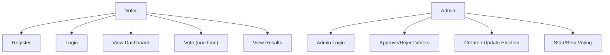

### 3.3.3 Database Design (MongoDB Collections)

The system uses four MongoDB collections:

- `users`
- `sessions`
- `elections`
- `votes`

**Table 3.4 Database Collections (Schema Summary)**

| Collection | Key Fields | Purpose |
|---|---|---|
| `users` | `userId` (unique), `email` (unique), `passwordHash`, `role`, `status` | Store admin/voter accounts and approval status |
| `sessions` | `sessionId` (unique), `userId`, `expiresAt` (TTL) | Keep users logged in using cookie sessions |
| `elections` | `electionId` (unique), `title`, `active`, `candidates[]` | Store latest election info and candidate list (backup) |
| `votes` | (`electionId`,`userId`) unique, `candidateId`, `transactionHash` | Record which user voted and store blockchain transaction hash |

**Table 3.5 Users Collection Fields**

| Field | Type | Example / Notes |
|---|---|---|
| `userId` | Number | Auto-increment style integer, unique |
| `name` | String | Full name (2–80 chars) |
| `email` | String | Unique, normalized to lowercase |
| `passwordHash` | String | `scrypt$<salt>$<key>` |
| `role` | String | `admin` or `voter` |
| `status` | String | `Approved`, `Pending Approval`, `Rejected` |

**Table 3.6 Elections Collection Fields**

| Field | Type | Example / Notes |
|---|---|---|
| `electionId` | Number | Currently uses `1` (single election) |
| `title` | String | Election title (5–120 chars) |
| `active` | Boolean | Voting open/closed |
| `candidates` | Array | Each has `candidateId`, `name`, `party`, `votes` |
| `createdAt` | String | ISO time string |
| `updatedAt` | String | ISO time string |

**Table 3.7 Votes Collection Fields**

| Field | Type | Example / Notes |
|---|---|---|
| `electionId` | Number | Links vote to election |
| `userId` | Number | Links vote to user |
| `candidateId` | Number | Candidate chosen by user |
| `transactionHash` | String | Blockchain tx hash (starts with `0x`) |
| `createdAt` | String | ISO time string |

**Table 3.8 Sessions Collection Fields**

| Field | Type | Example / Notes |
|---|---|---|
| `sessionId` | String | Random hex id stored in cookie `btvs_sid` |
| `userId` | Number | User linked to session |
| `createdAt` | String | ISO time string |
| `expiresAt` | Date | TTL index auto-deletes expired sessions |

### 3.3.3.1 Database Indexes and Data Integrity

The database uses indexes to prevent duplicates and improve performance.

Important indexes used:

- Unique `users.userId`
- Unique `users.email`
- Unique `elections.electionId`
- Unique `votes (electionId, userId)` to prevent multiple votes by the same user
- Unique `sessions.sessionId`
- TTL index on `sessions.expiresAt` so expired sessions are removed automatically

This is a very strong and simple way to enforce rules at the database level, even if the UI or API is called multiple times.

**Figure 3.3 ER Diagram (MongoDB Collections)**

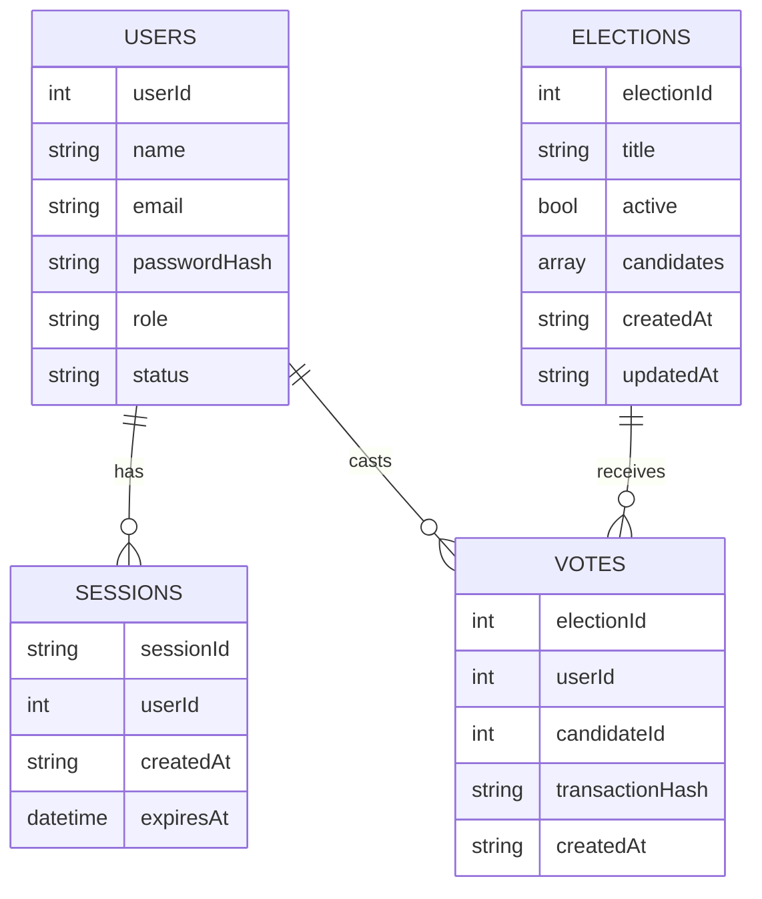

### 3.3.4 Smart Contract Design (Blockchain Layer)

The smart contract `TransparentVoting.sol` stores:

- election title
- election active/closed state
- candidate list and vote counts
- “has user voted” tracking using election nonce

**Figure 3.5 Smart Contract Data View**

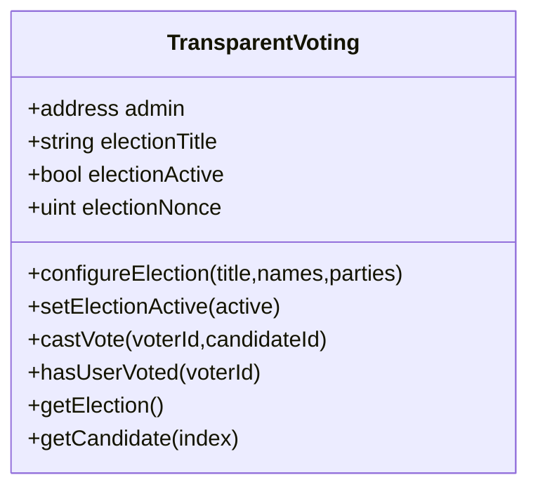

### 3.3.4.1 Why a Local Blockchain (Ganache) is Used

Using a public blockchain for a student project creates many extra problems:

- users must manage wallets and private keys
- gas fees are required
- network delays make demos hard

Ganache solves these problems by creating a local blockchain that behaves like Ethereum, but runs on the same machine. This makes the project:

- easy to run
- easy to reset
- easy to demonstrate during presentation

### 3.3.4.2 Smart Contract Functions (Simple Explanation)

The contract `TransparentVoting.sol` provides these main functions:

- `configureElection(title, names, parties)`: sets a new election (resets candidates and increases `electionNonce`)
- `setElectionActive(active)`: opens or closes the voting
- `castVote(voterId, candidateId)`: increases a candidate vote count and blocks repeated voting for the same `voterId` in the current election nonce
- `hasUserVoted(voterId)`: checks if the voter id already voted in the current election
- `getElection()`: returns title, active flag, nonce, and candidate count
- `getCandidate(index)`: returns candidate details and vote count

Events are emitted so that in a real blockchain explorer it is possible to track changes:

- `ElectionConfigured`
- `ElectionStatusChanged`
- `VoteCast`

### 3.3.4.3 Hybrid Consistency (DB + Chain)

The system checks voting in **two places**:

- MongoDB: `votes` collection unique index prevents duplicate vote records
- Blockchain: `hasUserVoted(userId)` prevents duplicate votes at contract level

This double checking makes the demo more reliable. Even if one layer fails, the other layer can still stop repeated voting.

### 3.3.5 Data Flow / Sequence (Vote Casting)

**Figure 3.6 Context DFD (High-Level Data Flow)**

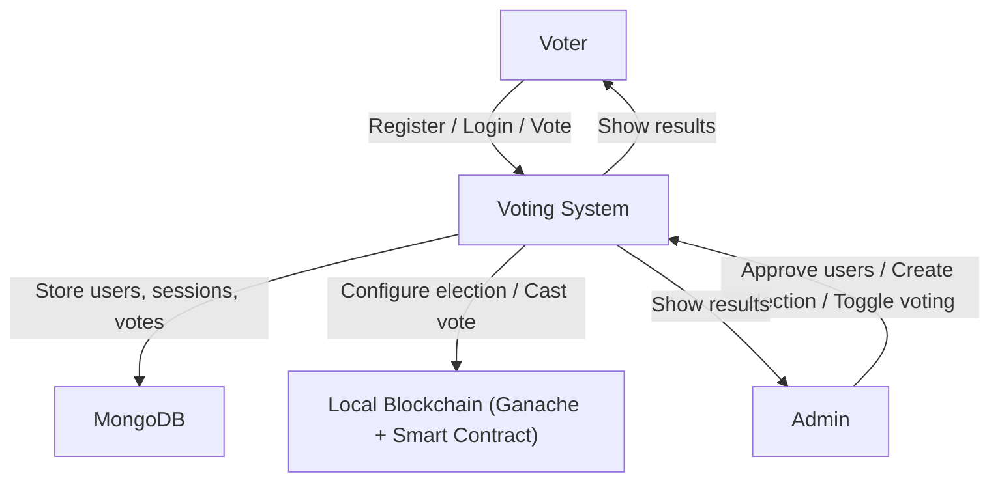

**Figure 3.7 DFD Level 1 (Main Processes)**

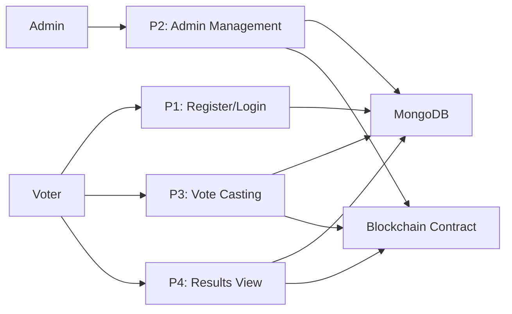

**Figure 3.8 Activity Diagram (Voter Registration + Approval)**

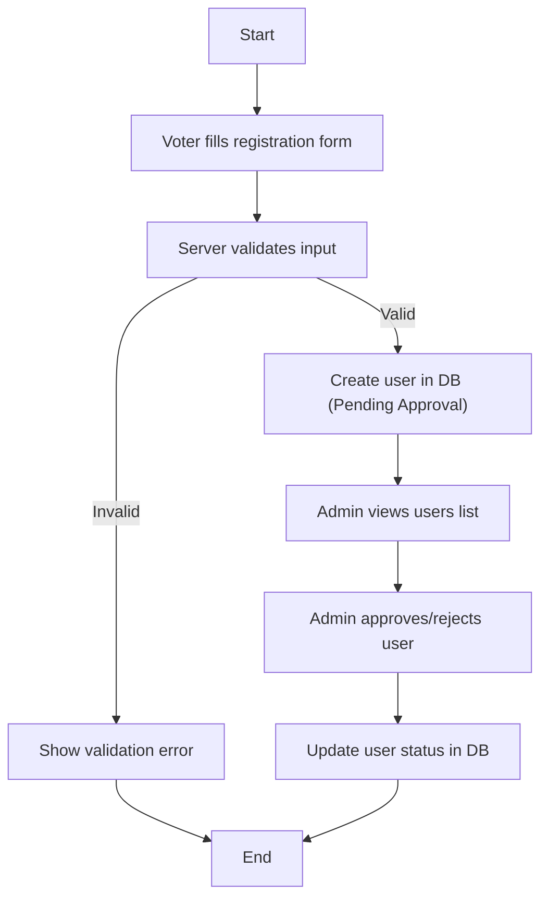

**Figure 3.9 Activity Diagram (Voting)**

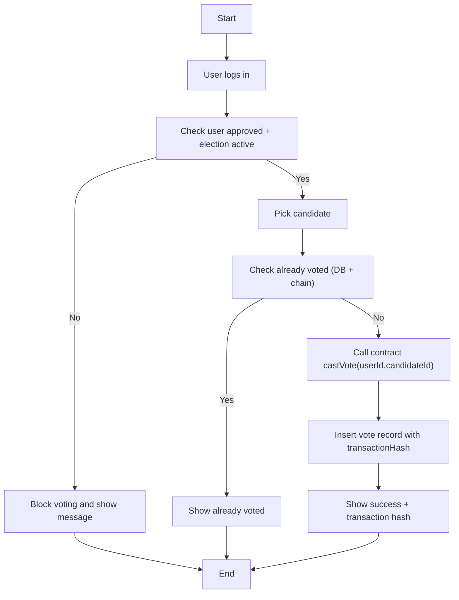

**Figure 3.10 User Status State Diagram**

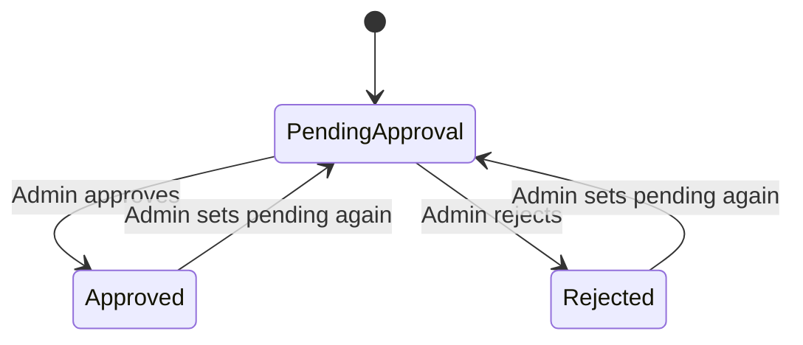

**Figure 3.4 Sequence Diagram (Cast Vote Flow)**

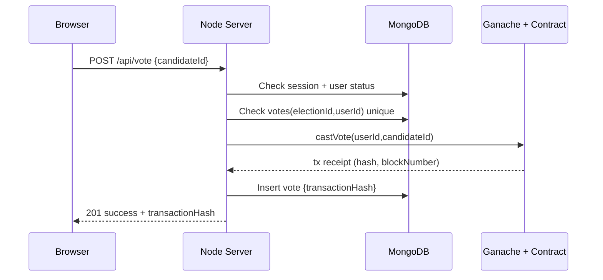

### 3.3.6 API Design

**Table 3.9 API Endpoints Summary**

| Method | Endpoint | Role | Purpose |
|---|---|---|---|
| GET | `/api/session` | Any | Get current logged-in user |
| POST | `/api/register` | Guest | Register voter (Pending Approval) |
| POST | `/api/login` | Guest | Login and create session cookie |
| POST | `/api/logout` | User | Logout and clear session |
| GET | `/api/dashboard` | User | Dashboard data (user + election + totalVotes) |
| GET | `/api/election` | User | Election view + canVote + hasVoted |
| POST | `/api/vote` | Approved voter | Cast vote (records blockchain tx hash) |
| GET | `/api/results` | Public | Get election results |
| GET | `/api/admin/users` | Admin | List all users |
| POST | `/api/admin/users/:id/status` | Admin | Approve/Pending/Reject user |
| GET | `/api/admin/election` | Admin | Get election config |
| POST | `/api/admin/election` | Admin | Create/update election, reset votes |
| POST | `/api/admin/election/toggle` | Admin | Start/end voting |

### 3.3.6.1 Error Handling Strategy

The system uses clear HTTP status codes and JSON error messages. This helps both the UI and the developer:

- the UI can show the correct message (like “already voted”)
- the developer can debug faster

**Table 3.13 Error Handling and Status Codes**

| Status Code | Meaning | Example Cases |
|---:|---|---|
| 200 | OK | Fetch dashboard, fetch results |
| 201 | Created | Register user, vote cast success, create election |
| 400 | Bad Request | Validation errors, invalid JSON |
| 401 | Unauthorized | Not logged in / invalid login |
| 403 | Forbidden | Voter tries admin endpoint, admin tries to vote |
| 404 | Not Found | Candidate not found, unknown route |
| 409 | Conflict | Email already exists, already voted |
| 500 | Server Error | Unexpected error |

### 3.3.6.2 Example API Payloads (Readable Samples)

Example request (register):

```json
{
  "name": "Student One",
  "email": "student1@college.edu",
  "password": "password123"
}
```

Example response (register success):

```json
{
  "message": "Registration completed. Wait for admin approval."
}
```

Example response (vote success):

```json
{
  "message": "Vote recorded successfully.",
  "transactionHash": "0x..."
}
```

### 3.3.7 Input Validation and Business Rules

The system validates inputs to avoid invalid data and reduce security issues.

**Table 3.10 Validation Rules Summary**

| Input | Rule | Reason |
|---|---|---|
| Name | 2–80 chars | Avoid empty/very long names |
| Email | Must match email pattern + lowercased | Consistent login + uniqueness |
| Password | 8–128 chars | Basic password strength |
| Election title | 5–120 chars | Enough detail, not too long |
| Candidates | 2–20 candidates | Reasonable election size |
| Candidate name | 2–80 chars | Avoid empty names |
| Candidate party | up to 80 chars | Optional but bounded |
| Vote candidateId | positive integer | Prevent invalid votes |
| User status | Approved / Pending / Rejected | Only allowed values |

Important business rules:

- Admin cannot vote.
- Only approved voters can vote.
- Voting must be active to cast a vote.
- One user can vote only once per election nonce.

### 3.3.8 Security Design (Simple Threat View)

This is a prototype, but it still includes basic security practices.

Security controls used:

- Passwords are hashed (scrypt) and never stored as plain text.
- Sessions use a random id and are stored server-side in MongoDB.
- Session cookie is **HttpOnly**, so JavaScript cannot read it.
- Session has an expiry time (TTL) to reduce long-term risk.
- Unique indexes prevent duplicates and enforce integrity.
- Admin routes require admin role.

**Table 3.11 Security Controls Checklist**

| Control | Implemented? | Notes |
|---|---:|---|
| Password hashing | Yes | `scrypt` in `lib/auth.js` |
| Timing-safe password compare | Yes | Prevents some side-channel leaks |
| HttpOnly cookie | Yes | Cookie name `btvs_sid` |
| Secure cookie in production | Yes | Added when `NODE_ENV=production` |
| Session expiry | Yes | MongoDB TTL on `expiresAt` |
| Duplicate vote prevention | Yes | DB unique index + chain check |
| Input validation | Yes | Central validation in `lib/validation.js` |
| Rate limiting | No | Recommended future improvement |
| CSRF protection | No | Recommended future improvement |

### 3.3.9 UI / Frontend Design

The UI is intentionally simple so that the system is easy to understand in a project demo.

Main pages:

- **Login page** (`index.html`): login form and demo credentials
- **Register page** (`register.html`): registration form
- **Dashboard page** (`dashboard.html`): shows election status, user status, and quick links
- **Voting page** (`voting.html`): shows candidates and allows one vote
- **Results page** (`results.html`): shows candidate vote counts and percentage bars
- **Admin page** (`admin.html`): manages users and election

Frontend logic (`app.js`) responsibilities:

- call APIs using `fetch`
- show messages/errors
- render candidate lists and results
- handle admin actions (approve user, create election, start/stop voting)

### 3.3.10 Algorithm / Logic Explanation (Simple)

#### A) Login Algorithm

1. Take email + password input
2. Normalize email (trim + lowercase)
3. Find user in database
4. Verify password hash
5. Create random session id
6. Store session in DB and set cookie

#### B) Vote Algorithm

1. Check user session (must be logged in)
2. Check role (must be voter, not admin)
3. Check status (must be Approved)
4. Check election active
5. Check DB: existing vote record? if yes, reject
6. Check chain: `hasUserVoted(userId)`? if yes, reject
7. Call chain `castVote(userId, candidateId)`
8. Save vote record to DB with transaction hash
9. Return success response with transaction hash

### 3.3.11 Sequence Diagrams for Important Flows

**Figure 3.11 Sequence Diagram (Login + Session)**

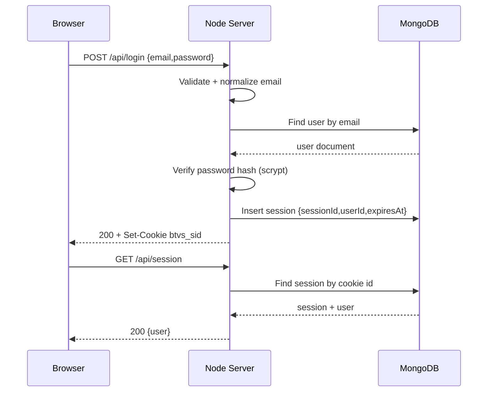

**Figure 3.12 Sequence Diagram (Admin Creates Election)**

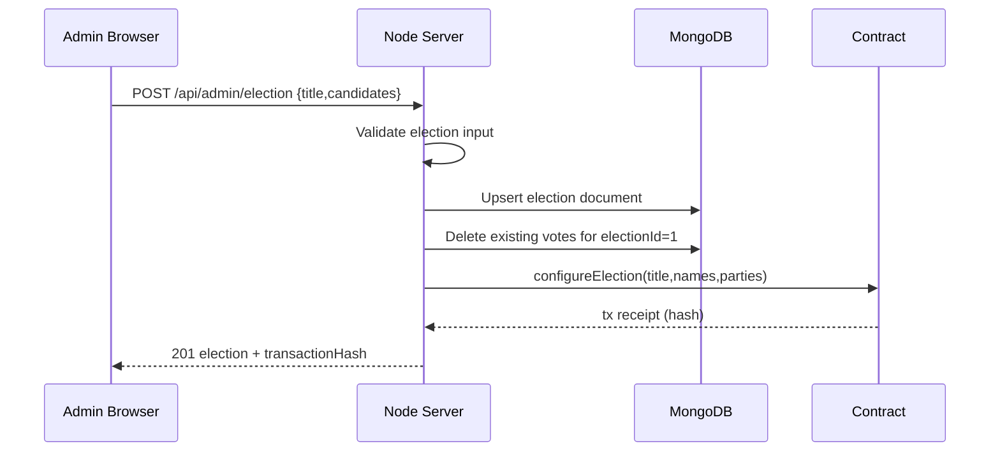

### 3.3.12 DFD Level 2 (Vote Process)

**Figure 3.13 DFD Level 2 (Vote Process Details)**

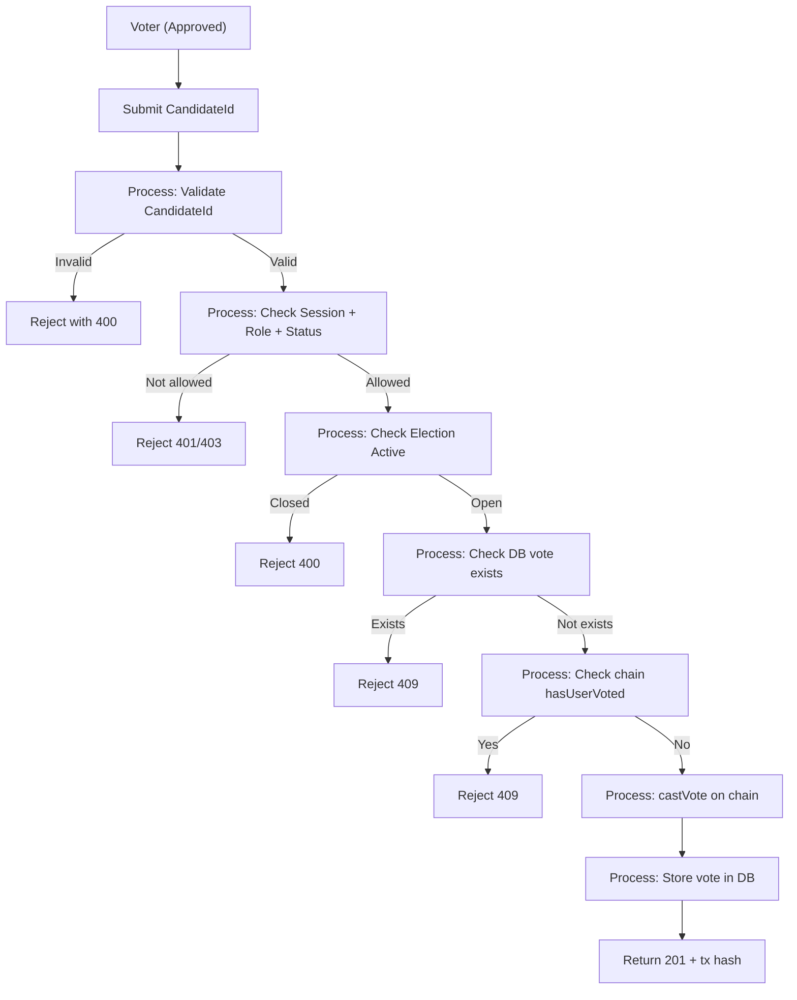

### 3.3.13 Sample MongoDB Documents (Examples)

These sample documents show how the data looks in MongoDB.

**Table 3.12 Sample MongoDB Documents (Examples)**

| Collection | Example (Simplified) |
|---|---|
| `users` | `{ userId: 2, name: "Aarav Student", email: "student@college.edu", role: "voter", status: "Approved" }` |
| `sessions` | `{ sessionId: "...", userId: 2, expiresAt: ISODate("...") }` |
| `elections` | `{ electionId: 1, title: "...", active: true, candidates: [{candidateId:1,name:"..."}] }` |
| `votes` | `{ electionId: 1, userId: 2, candidateId: 1, transactionHash: "0x..." }` |

### 3.3.14 Server-Side Design Details (Node.js)

The backend uses a simple structure so it is easy to read and explain in a viva/presentation.

#### 3.3.14.1 Request Routing

The server receives HTTP requests and checks:

- the request method (GET/POST)
- the URL path (`/api/login`, `/api/vote`, etc.)
- the current logged-in user (by reading the session cookie)

Then it executes the correct logic and returns a JSON response.

This style is simple and works well for a small prototype. In bigger systems, people often use frameworks like Express, but the core logic stays similar: route → validate → business rules → DB/chain actions → response.

#### 3.3.14.2 JSON Response Pattern

The project uses a consistent JSON response format:

- Success responses contain useful data or a success message.
- Error responses contain an `error` field with a human-readable message.

This consistency helps the frontend to display messages easily.

#### 3.3.14.3 Static File Serving

The server also serves UI files:

- `index.html` for login
- `register.html` for registration
- `dashboard.html` for voter dashboard
- `voting.html` for casting vote
- `results.html` for results
- `admin.html` for admin panel
- `styles.css` and `app.js`

This keeps deployment simple: one server can handle both UI and API.

### 3.3.15 Session and Cookie Management (In Detail)

Sessions are used so the user does not need to login on every request.

#### 3.3.15.1 How a Session is Created

1. User sends login request with email and password.
2. Server verifies password.
3. Server creates a random `sessionId`.
4. Server stores `{sessionId, userId, expiresAt}` in MongoDB.
5. Server returns `Set-Cookie: btvs_sid=<sessionId>` so the browser stores it.

#### 3.3.15.2 Why HttpOnly Cookie is Important

HttpOnly cookies cannot be read by JavaScript. This reduces the risk of session theft using common browser attacks where malicious scripts try to read session tokens.

#### 3.3.15.3 Session Expiry (TTL)

Sessions have an expiry date. MongoDB TTL index deletes expired sessions automatically. This is good because:

- it reduces database size
- it reduces long-lived session risk
- it forces re-login after long time

#### 3.3.15.4 Logout Handling

On logout:

- server deletes the session document in MongoDB
- server clears the cookie by setting `Max-Age=0`

This ensures that the session cannot be reused after logout.

### 3.3.16 Election Lifecycle (End-to-End Explanation)

The election lifecycle describes how the admin creates and controls an election and how voters interact with it.

#### 3.3.16.1 Create/Update Election

When admin creates an election:

1. Server validates title and candidates list.
2. Server saves election in MongoDB (as backup record).
3. Server deletes old votes in MongoDB so a new election starts clean.
4. Server calls the smart contract `configureElection(...)`:
   - it resets candidates on chain
   - it increases `electionNonce` which also resets “already voted” mapping logically
5. Server returns transaction hash to the admin UI.

This means the blockchain becomes the “source of truth” for candidates and vote counts.

#### 3.3.16.2 Start/Stop Voting

Admin can toggle voting:

1. Server reads current election status.
2. Server updates MongoDB election `active` flag.
3. Server calls smart contract `setElectionActive(true/false)`.
4. Server returns transaction hash.

Voters can vote only when the blockchain election is active.

#### 3.3.16.3 Results Visibility

Results can be shown on the results page. The system reads election state and candidates from the blockchain (when configured), and displays vote counts and total votes.

### 3.3.17 Failure Handling and Consistency Rules

Because the project uses DB + blockchain, it is important to handle failures safely.

Main rule followed in vote casting:

- If blockchain vote transaction fails, the system should **not** store a vote record in MongoDB.

That means the vote is recorded only if both steps succeed:

1. Contract `castVote` succeeds and returns transaction receipt.
2. MongoDB insert of vote record succeeds.

If MongoDB insert fails (for example due to duplicate key), the system returns a conflict error and the voter is told they have already voted. Because the contract also blocks repeated voting, the system still stays safe.

### 3.3.18 Technical Methodologies Used (Beyond Agile)

Agile is the project management methodology. In addition, the project uses some simple technical methodologies:

#### 3.3.18.1 Modular Design

Code is split into small modules:

- `lib/auth.js` for password hashing and verification
- `lib/validation.js` for input validation rules
- `lib/blockchain.js` for contract compilation, deployment, and calls

This improves readability and makes testing easier.

#### 3.3.18.2 Validation-First Approach

Before writing data to DB or calling the blockchain, inputs are validated. This reduces bugs and prevents invalid states like:

- empty candidate list
- invalid email format
- invalid candidate id

#### 3.3.18.3 Defense in Depth (Two-Layer Vote Protection)

The system prevents double voting using:

- MongoDB unique index on `(electionId, userId)`
- Smart contract check using `hasUserVoted(userId)` and internal mapping

Even if one layer is bypassed, the other layer still provides protection.

### 3.3.19 Ethical and Practical Considerations (Short)

Voting is a sensitive topic. In real elections, the system must protect:

- voter privacy
- fairness (no coercion, no impersonation)
- accessibility for all voters

This project is built as an educational prototype. It is not recommended for real elections without major upgrades in security, privacy, and independent audits.

### 3.3.20 Future Design Enhancements (Design Ideas)

If this project is expanded, design improvements can include:

- voter wallet-based voting (each voter signs their own transaction)
- better privacy using cryptographic voting schemes
- audit logs for admin actions stored in append-only storage
- rate limiting and stronger security protections
- better UI for exploring blockchain transactions and contract events

## 3.4 Detailed UI Design (Page-by-Page)

This section explains each UI page in simple language. This helps the reader understand how the user interacts with the system.

### 3.4.1 Login Page (index.html)

Purpose:

- Allow a user to login using email and password.
- Show demo credentials for quick testing.

Main elements:

- Email input field
- Password input field
- Login button
- Link to registration page

What happens when user clicks login:

1. Browser collects the email and password.
2. Browser sends `POST /api/login`.
3. If login is correct, server creates a session cookie.
4. Browser redirects user to the dashboard.

User-friendly behavior:

- If login fails, the page shows a clear message like “Invalid email or password.”

### 3.4.2 Registration Page (register.html)

Purpose:

- Allow a new voter to register.
- Put the new voter into “Pending Approval” state.

Main elements:

- Full name input
- Email input
- Password input
- Register button

Registration flow:

1. Browser sends `POST /api/register`.
2. Server validates input (name length, email format, password length).
3. Server checks if email already exists.
4. If valid, server stores user in DB with status “Pending Approval.”
5. User sees a message “Wait for admin approval.”

### 3.4.3 Dashboard Page (dashboard.html)

Purpose:

- Show voter’s approval status.
- Show election overview (title, status, number of candidates, total votes).
- Provide quick action buttons.

Key information shown:

- User name and role
- User status pill (Approved / Pending / Rejected)
- Election status (Open / Closed)
- Total candidates
- Total votes

Important rule:

- If the user is not approved or voting is closed, the “Go to Vote” button becomes disabled.

This prevents confusion and also reduces invalid vote attempts.

### 3.4.4 Voting Page (voting.html)

Purpose:

- Show candidates.
- Allow an approved voter to cast exactly one vote.

What the user sees:

- Election state message (open/closed)
- Candidate cards (name, party)
- Vote button per candidate
- A “Transaction Hash” area

Voting flow in UI:

1. The page loads `/api/election` to know if the user can vote.
2. If user already voted, the banner says “You have already voted.”
3. If the user can vote, the banner says “Select one candidate to cast your vote.”
4. When the user clicks Vote, UI calls `POST /api/vote`.
5. On success, UI shows transaction hash returned by the server.

### 3.4.5 Results Page (results.html)

Purpose:

- Show election results to demonstrate transparency.

What is shown:

- Election title
- Total votes
- Candidate vote counts
- Percentage bars (easy to understand)

This page is designed for readability. It can be used by both admin and voters, and even by guests (public endpoint).

### 3.4.6 Admin Panel (admin.html)

Purpose:

- Manage voters (approve/reject/pending).
- Create/update election (title + candidates).
- Start/stop voting.

Admin user management:

- Admin sees a table of all registered users.
- Admin can click Approve / Reject / Pending.
- Server updates user status in MongoDB.

Election creation:

- Admin enters election title.
- Admin enters candidate list (one per line).
- Optional format: `Name | Party`.

When admin creates election:

1. UI calls `POST /api/admin/election`.
2. Server validates title and candidates.
3. Server saves election in DB and configures election on blockchain.
4. UI displays a success message.

Start/stop voting:

- Admin clicks a button to toggle election status.
- Server updates both DB and blockchain.

### 3.4.7 Navigation and User Experience (UX)

The navigation bar provides links to:

- Home (dashboard)
- Vote
- Results
- Admin (visible only to admin)

UX design choices used:

- clear status pills (Approved/Pending/Rejected, Open/Closed)
- simple colors and spacing
- minimal text where possible
- error messages shown near actions

These choices make the project easy to present and easy for new users to understand.

## 3.5 Data Lifecycle (How Data Moves and Changes)

This section explains how data changes over time in the system.

### 3.5.1 User Data Lifecycle

1. User registers → `users` document created with status `Pending Approval`.
2. Admin approves user → status changes to `Approved`.
3. User logs in → `sessions` document created.
4. User logs out or session expires → `sessions` document removed.

### 3.5.2 Election Data Lifecycle

1. Admin creates election → MongoDB election record updated.
2. Server configures election on blockchain → candidates and electionNonce updated.
3. Admin starts election → `active=true` in DB and contract.
4. Votes are cast → blockchain counts increase; DB stores vote records.
5. Admin ends election → `active=false`.
6. Admin creates a new election → votes are reset in DB and on blockchain.

### 3.5.3 Vote Data Lifecycle

1. Voter sends vote request.
2. Server checks rules (session, approved status, not voted).
3. Blockchain vote is recorded and a transaction hash is produced.
4. Server stores vote record in MongoDB with transaction hash.

The transaction hash acts like a reference that can be shown during presentation as “proof” that a blockchain transaction happened.

## 3.6 Smart Contract Security and Design Limitations

The smart contract is intentionally simple. Still, it is important to understand its security design.

### 3.6.1 Admin-Only Functions

In this contract, only the admin address can call:

- configure election
- start/stop voting
- cast vote

This is a design decision for a demo where the server acts as the trusted controller. In real blockchain voting, voters usually cast votes themselves using their wallets, so there is no single trusted voting caller.

### 3.6.2 One Vote Per VoterId

The contract blocks double voting using:

- `votedElectionByUser[voterId] != electionNonce`

When a new election is configured, `electionNonce` increases, so voters can vote again for the new election.

### 3.6.3 Privacy Note

This contract does not store who voted for whom directly as a public mapping. It stores vote counts. However, because the server calls votes and has the DB record of `userId` and `candidateId`, the system itself can still know who voted for whom. This is acceptable for a demo, but it is not strong privacy.

### 3.6.4 Attack Considerations (Simple)

Possible risks in real systems:

- admin misuse (changing election unfairly)
- server compromise (casting votes incorrectly)
- denial of service (blocking users)

This project is not meant to solve all these risks. It is meant to demonstrate concepts clearly.

## 3.7 Performance Considerations (Prototype Level)

This system is designed for small elections (like a class election).

Reasons it should perform fine for small scale:

- MongoDB queries are simple and indexed.
- One election and limited candidates reduce complexity.
- Blockchain is local, so transactions are fast.

Limitations for large scale:

- single Node.js process may become a bottleneck
- local blockchain is not a real distributed network
- UI and API are not optimized for thousands of concurrent users

## 3.8 Maintainability and Scalability (Future Ready Ideas)

To make the project easier to maintain in the future, we can:

- add a proper routing framework (like Express) for cleaner code
- add a logging library and structured logs
- separate frontend and backend into separate folders/projects
- add integration tests with a test MongoDB database
- add a real CI pipeline (lint + tests)

These are improvements that can be done after the prototype stage.

## 3.9 User Manual (How to Use the System)

This section is written like a simple guide so anyone can operate the system during a demo.

### 3.9.1 For Voters (Step-by-Step)

1. Open the system in a browser: `http://127.0.0.1:3000`
2. Click **Create an account** to register.
3. Fill your name, email, and password and submit.
4. After registration, your account is **Pending Approval**.
5. Wait for the admin to approve your account.
6. Once approved, go back to login page and login.
7. Open the dashboard and check:
   - your status is Approved
   - election status is Open (Active)
8. Click **Go to Vote**.
9. Select one candidate and click Vote.
10. After successful voting, note the **transaction hash** shown on screen.
11. Open **Results** page to see updated vote counts.

Important notes for voters:

- If your status is not Approved, you cannot vote.
- If the election is closed, voting is blocked.
- You can vote only once per election.

### 3.9.2 For Admin (Step-by-Step)

1. Login using admin credentials.
2. Open the **Admin** panel from the navigation bar.
3. In **Registered Users**, review new registrations.
4. Approve a user by clicking **Approve**.
5. To create an election:
   - enter election title
   - enter candidates (one per line, optional `Name | Party`)
   - click **Create Election**
6. To open voting, click **Start Voting**.
7. To end voting, click **End Voting**.
8. Check **Results** page to view vote totals.

Important notes for admin:

- Creating a new election resets old votes (for the demo).
- Start/stop voting changes both DB and blockchain state.

## 3.10 Troubleshooting Guide (Common Issues)

### 3.10.1 Cannot Connect to MongoDB

Symptoms:

- server fails to start
- errors about MongoDB connection

Fix:

- ensure MongoDB is running
- check `MONGODB_URI` and `MONGODB_DB` values

### 3.10.2 Voting Works but No Transaction Hash Shows

Possible reasons:

- blockchain call failed
- server error occurred before response

Fix:

- check server console logs
- restart the server and try again
- ensure `.chain/` folder is writable

### 3.10.3 “Already voted” Error for a New Voter

Possible reasons:

- vote record exists in MongoDB
- blockchain mapping shows voter already voted

Fix for demo:

- admin can create a new election to reset vote history (new `electionNonce`)

---

# 4. IMPLEMENTATION PLAN

## 4.1 Development Methodology

This project is created using **Agile methodology**. Agile means we do not try to build everything in one big step. Instead, we build the system in small parts, test each part, and improve continuously.

This project follows a **Scrum-like** approach (simple version) because it is easy for a student team:

- break the project into small tasks (backlog)
- plan small time boxes (sprints)
- implement and test features
- review the progress and improve

**Figure 4.1 Agile Workflow (Iterative Development)**

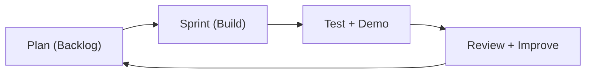

### 4.1.1 Why Agile is Suitable for This Project

Agile is suitable because:

- requirements can change during development (UI changes, security improvements, new validations)
- we can show progress early (working login, working admin panel, etc.)
- issues are found early (for example duplicate voting prevention)
- it supports continuous improvement (refactor, improve UI, add tests)

### 4.1.2 Scrum Roles (Simple)

In a student project, one person can take multiple roles.

**Table 4.5 Agile Roles and Responsibilities**

| Role | Responsibility (Simple) |
|---|---|
| Product Owner | Defines what features are needed, sets priority |
| Scrum Master | Helps remove blockers, keeps the process consistent |
| Development Team | Builds features, tests, and documents |

### 4.1.3 Scrum Ceremonies (Simple)

For this project, the ceremonies can be:

- **Sprint planning:** decide what to build in the next sprint
- **Daily stand-up (short):** what was done yesterday, what to do today, any blocker
- **Sprint review:** demo completed features
- **Sprint retrospective:** discuss what went well and what to improve

This project can be implemented using a simple iterative method (Agile-style):

1. Build basic UI pages and server routes
2. Add MongoDB collections and indexes
3. Add authentication and sessions
4. Add smart contract and blockchain integration
5. Add voting rules and result view
6. Test and improve validation and error handling

### 4.1.4 Agile Artifacts (What Documents We Maintain)

Agile has three main artifacts:

- **Product Backlog:** all features/tasks list with priority
- **Sprint Backlog:** selected tasks for the current sprint
- **Increment:** working software at the end of the sprint

**Figure 4.3 Agile Artifacts Overview**

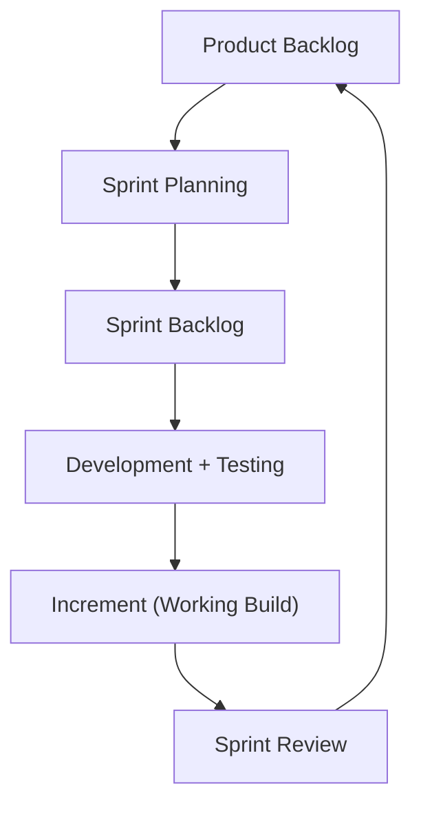

### 4.1.5 Definition of Done (DoD)

Definition of Done is a simple checklist that tells us when a task is truly finished.

**Table 4.11 Definition of Done (DoD)**

| Item | Meaning |
|---|---|
| Code complete | Feature is implemented and works |
| Validation added | Input validation and error cases handled |
| Basic tests | Unit test or manual test steps written |
| UI feedback | User sees success/error messages |
| No broken flows | Register/login/admin/vote/results still work |
| Documentation updated | Report updated with changes |

## 4.2 Module Breakdown

**Table 4.1 Module Breakdown**

| Module | Files | Responsibilities |
|---|---|---|
| Server + Routing | `server.js` | HTTP server, API routes, static files |
| Authentication | `lib/auth.js` | Password hashing (scrypt), session id generation |
| Input Validation | `lib/validation.js` | Validate and normalize user inputs |
| Blockchain Layer | `lib/blockchain.js`, `contracts/TransparentVoting.sol` | Compile/deploy contract, configure election, cast vote |
| Frontend UI | `index.html`, `register.html`, `dashboard.html`, `voting.html`, `results.html`, `admin.html`, `app.js`, `styles.css` | Pages, fetch calls, UI rendering |
| Tests | `test/*.test.js` | Unit tests for auth and validation |

## 4.3 Tools, Platforms, and Languages

**Table 4.2 Tools, Platforms, and Languages**

| Item | Used For |
|---|---|
| Node.js | Server runtime |
| MongoDB | Database storage |
| MongoDB Node Driver | DB connection and queries |
| Solidity | Smart contract language |
| Ganache | Local Ethereum-compatible blockchain |
| Ethers.js | Contract deployment and calls |
| HTML/CSS/JavaScript | Frontend UI |

## 4.4 Product Backlog (High Level)

The backlog is a list of tasks/features that the team wants to build.

**Table 4.6 Product Backlog (High Level)**

| Priority | Backlog Item |
|---:|---|
| 1 | Basic server + static page routing |
| 2 | Registration + validation |
| 3 | Login/logout + sessions |
| 4 | Admin user list + approve/reject workflow |
| 5 | Election create/update API + admin UI |
| 6 | Voting page + vote API |
| 7 | Blockchain contract compile/deploy |
| 8 | Blockchain vote casting + transaction hash display |
| 9 | Results page with totals |
| 10 | Unit tests + report documentation |

## 4.5 User Stories (Agile Requirement Style)

User stories describe requirements in a simple sentence.

**Table 4.7 User Stories with Acceptance Criteria**

| User Story | Acceptance Criteria (Simple) |
|---|---|
| As a voter, I want to register so that I can request access to voting. | Registration saves my data and my status is Pending Approval. |
| As an admin, I want to approve a voter so that only eligible voters can vote. | Admin can change status to Approved/Rejected/Pending. |
| As a voter, I want to login so that I can see the election dashboard. | Correct credentials create session and redirect to dashboard. |
| As a voter, I want to vote once so that my vote is counted. | If I already voted, system blocks second vote. |
| As a voter, I want to see a transaction hash so that I can verify blockchain recording. | After voting, a hash is displayed. |
| As an admin, I want to create an election so that voters can vote for candidates. | Title and 2–20 candidates are saved and configured on chain. |
| As an admin, I want to start/stop voting so that voting happens in allowed time only. | Toggle changes status and voters cannot vote when closed. |
| As a guest, I want to view results so that transparency is shown. | Results page shows totals and candidate counts. |

## 4.6 Sprint Plan (Agile Execution Plan)

In Agile, the work can be planned into short sprints. Below is an example sprint plan for a 4-sprint project.

**Table 4.8 Sprint Plan (4 Sprints Example)**

| Sprint | Main Goal | Output |
|---:|---|---|
| Sprint 1 | Project setup + basic UI + routing | Pages load, server serves files, base layout ready |
| Sprint 2 | Auth + DB + admin approval workflow | Register/login/logout works, admin can approve users |
| Sprint 3 | Election management + voting rules | Admin creates election, voters can vote once |
| Sprint 4 | Blockchain integration + tests + documentation | Contract deploy works, tx hash shown, report completed |

**Figure 4.2 Sample Sprint Burndown (Template)**

```text
Remaining Work
|
|\\
| \\\\
|  \\\\__
|       \\__
+------------------> Days
```

### 4.6.1 Estimation (Story Points) in Simple Language

In Agile, teams often estimate tasks using **story points** instead of hours. Story points are a simple way to express:

- how hard the task is
- how risky it is
- how much unknown work is inside it

Example:

- 1 point: very small task (small UI change)
- 3 points: medium task (new API + UI)
- 5 points: bigger task (blockchain integration flow)

For a student project, story points do not need to be perfect. They are mainly used to:

- avoid putting too much work in one sprint
- see progress sprint by sprint

### 4.6.2 Sample Sprint Backlog (What We Pick for a Sprint)

Sprint backlog is the list of tasks selected from the product backlog for the current sprint.

Example Sprint 2 backlog (Auth + Admin approval):

| Task | Estimate | Notes |
|---|---:|---|
| Create `users` collection and indexes | 3 | Unique email and userId |
| Registration API + validation | 5 | Handle duplicate email errors |
| Login API + sessions | 5 | HttpOnly cookie, TTL expiry |
| Logout API | 2 | Clear cookie and delete session |
| Admin users list | 3 | Show all users |
| Admin approve/reject status | 3 | Update status values |
| UI wiring in `app.js` | 5 | Render user table and messages |

This makes sprint work clear, measurable, and easier to discuss in stand-up meetings.

### 4.6.3 Daily Stand-up (Simple Questions)

A daily stand-up is a short meeting (5–10 minutes). Each team member answers:

1. What did I do yesterday?
2. What will I do today?
3. Do I have any blockers?

For a student project, this can be done informally (even through chat). The main goal is to keep everyone aligned and remove blockers early.

### 4.6.4 Sprint Review and Retrospective (Simple)

At the end of a sprint:

- **Sprint review:** demo working features (example: registration and login works end-to-end).
- **Retrospective:** discuss improvements (example: add better validation messages, write more tests).

Example retrospective improvements:

- Improve error messages shown on UI
- Add more unit tests for validation edge cases
- Refactor duplicated logic
- Add better documentation and diagrams

### 4.6.5 Change Management (How We Handle New Requirements)

In Agile, new requirements can come anytime. Instead of changing everything in the middle of a sprint:

- we add new requirements into the **product backlog**
- we discuss priority (is it critical or optional?)
- we pick it in the next sprint planning

This avoids last-minute messy changes and keeps the sprint goal stable.

## 4.7 Project Timeline (Gantt Chart)

**Table 4.3 Project Timeline (Simple Gantt)**

| Task | Week 1 | Week 2 | Week 3 | Week 4 |
|---|---:|---:|---:|---:|
| Requirements + Design | ✓ |  |  |  |
| UI Pages + Routing | ✓ | ✓ |  |  |
| MongoDB Integration |  | ✓ | ✓ |  |
| Smart Contract + Ganache |  | ✓ | ✓ |  |
| Voting Rules + Results |  |  | ✓ | ✓ |
| Testing + Final Report |  |  |  | ✓ |

## 4.8 Testing Plan and Methodology

Testing is important to confirm that the system works correctly and handles errors safely.

Types of testing used:

- **Unit testing:** small functions like validation and password hashing
- **Functional testing:** check all user flows (register, approve, vote, results)
- **Negative testing:** try invalid inputs and confirm the system blocks them
- **Security testing (basic):** check session rules, role rules, and double voting prevention

**Table 4.9 Test Cases (Functional)**

| Test ID | Scenario | Expected Result |
|---|---|---|
| TC-1 | Register with valid input | 201 success, status Pending Approval |
| TC-2 | Register with existing email | 409 conflict, shows error |
| TC-3 | Login with correct password | 200 success, session cookie set |
| TC-4 | Login with wrong password | 401 error |
| TC-5 | Admin views user list | Shows all users |
| TC-6 | Admin approves a voter | Status becomes Approved |
| TC-7 | Admin creates election (2+ candidates) | Election saved, votes reset |
| TC-8 | Admin starts voting | Election becomes Active |
| TC-9 | Approved voter casts vote | 201 success + transactionHash |
| TC-10 | Same voter votes again | 409 conflict or blocked already voted |
| TC-11 | Results page | Shows total votes + per-candidate votes |

**Table 4.10 Test Cases (Security + Negative)**

| Test ID | Scenario | Expected Result |
|---|---|---|
| ST-1 | Access admin endpoints as voter | 403 forbidden |
| ST-2 | Vote as admin | 403 forbidden |
| ST-3 | Vote when not approved | 403 forbidden |
| ST-4 | Vote when election closed | 400 error |
| ST-5 | Send invalid JSON body | 400 error |
| ST-6 | Send huge request body | Request rejected |

### 4.8.1 Unit Testing Methodology (What We Test)

Unit tests focus on small functions that are easy to test without a browser.

In this project, unit testing is suitable for:

- input validation rules (`lib/validation.js`)
- password hashing and verification (`lib/auth.js`)

Why these parts are good for unit tests:

- they have clear input and output
- they do not depend on MongoDB or blockchain
- they are critical for security and correctness

Examples:

- invalid emails should be rejected
- weak passwords should be rejected
- `verifyPassword()` must return true only for correct password
- session ids should have correct format

### 4.8.2 Manual Functional Testing (End-to-End Flow)

Manual testing is used to validate full flows that involve UI + API + DB + blockchain:

1. Register a new voter
2. Login as admin
3. Approve the voter
4. Create or update an election
5. Start voting
6. Login as voter and cast a vote
7. Confirm:
   - transaction hash is returned
   - voter cannot vote again
   - results show updated counts

Manual testing is important in a hybrid system because it confirms integration between MongoDB and blockchain.

### 4.8.3 Negative Testing (Why It Matters)

Negative testing means we intentionally try wrong inputs. This helps ensure:

- the server does not crash on invalid JSON
- the system responds with clear error messages
- security rules are enforced even if someone calls the API directly

Examples:

- send `candidateId = 0`
- call admin endpoints as a normal voter
- try voting when election is closed

### 4.8.4 Test Data and Demo Data

The project includes seeded demo users and a demo election for presentation. This improves reliability because:

- the system can be demonstrated immediately after setup
- the admin account is always available for testing

However, in a real deployment, seed data should be removed and user accounts should be created securely.

### 4.8.5 Bug Handling (Simple Process)

During development, bugs can be handled in a simple Agile-friendly way:

1. Identify the bug during testing
2. Write a clear description (steps to reproduce)
3. Fix the bug in a small commit/change
4. Re-test the affected flow
5. Add a test if possible (especially for validation/auth bugs)

## 4.9 Deployment / Run Plan (Local Demo)

Steps to run on a local machine:

1. Start MongoDB locally
2. Set environment variables (or use defaults)
3. Install dependencies using `npm install`
4. Run the server using `npm start`
5. Open `http://127.0.0.1:3000` in a browser

Important demo note:

- Blockchain data and deployment info are stored in `.chain/`
- The server automatically compiles and deploys the smart contract if needed

### 4.9.1 Environment Variables (Simple)

Main environment variables:

- `PORT`: server port (default 3000)
- `MONGODB_URI`: MongoDB connection URI
- `MONGODB_DB`: database name
- `NODE_ENV`: if set to `production`, cookies add `Secure` flag
- `BLOCKCHAIN_CHAIN_ID`: local chain id (default 1337)
- `BLOCKCHAIN_MNEMONIC`: Ganache mnemonic used to generate accounts

For local demo, defaults are enough. For a more controlled demo, setting these values in a `.env` file (and loading it) can be useful, but this project keeps configuration minimal.

### 4.9.2 Folder and File Structure (Readable Summary)

Important files/folders:

- `server.js`: backend HTTP server and API routes
- `lib/`: helper modules (auth, validation, blockchain)
- `contracts/TransparentVoting.sol`: smart contract source code
- `.chain/`: blockchain deployment metadata and Ganache local storage
- `test/`: unit tests
- `docs/`: report documentation (Markdown and generated Word file)

This structure helps keep the project easy to navigate.

## 4.10 Work Breakdown Structure (WBS)

Work Breakdown Structure splits the project into smaller tasks. This helps planning and progress tracking in Agile sprints.

**Table 4.12 Work Breakdown Structure (WBS)**

| WBS ID | Task | Output |
|---|---|---|
| 1.0 | Requirement gathering | Problem statement, objectives, requirements list |
| 2.0 | UI pages | Login, register, dashboard, vote, results, admin pages |
| 3.0 | Backend APIs | Register/login/logout, election, vote, admin endpoints |
| 4.0 | MongoDB design | Collections + indexes + seed data |
| 5.0 | Blockchain layer | Contract compile/deploy, configure election, cast vote |
| 6.0 | Integration | End-to-end flow working |
| 7.0 | Testing | Unit tests + manual test checklist |
| 8.0 | Documentation | Final report, diagrams, tables |

## 4.11 Resource Requirements

**Table 4.13 Resource Requirements**

| Resource Type | Requirement |
|---|---|
| Hardware | Laptop/PC with at least 8GB RAM recommended |
| OS | Windows / macOS / Linux |
| Runtime | Node.js 18+ |
| Database | MongoDB local instance |
| Tools | Code editor (VS Code), terminal |
| Libraries | `mongodb`, `ganache`, `ethers`, `solc` |
| Optional | Git for version control |

## 4.12 Risk Analysis

**Table 4.4 Risk Analysis**

| Risk | Impact | Mitigation |
|---|---|---|
| Blockchain complexity | Delays and bugs | Keep contract small and use local Ganache |
| Data mismatch (DB vs chain) | Wrong results | Use single election id, verify “has voted” in both layers |
| Session security issues | Unauthorized access | HttpOnly cookies, TTL session expiry |
| Duplicate voting | Unfair election | Unique index on (`electionId`,`userId`) + contract check |
| System demo failure | Presentation risk | Seed demo accounts and default election |

## 4.13 Version Control and Collaboration (Recommended Practice)

Even in a small project, version control helps keep work organized.

Recommended approach:

- Use Git to track changes.
- Commit small changes regularly (one feature or one fix per commit).
- Write clear commit messages (example: “Add vote endpoint validation”).

Simple collaboration rules:

- Do not edit the same file at the same time without coordination.
- Review changes before merging (even a quick self-review).
- Keep the `main` branch stable; do risky experiments in a separate branch.

Why this is useful:

- It reduces risk of losing code.
- It helps during report writing because you can track what changed and why.

## 4.14 Documentation Methodology (How Report Was Built)

Documentation was created alongside development so that:

- features are explained correctly
- diagrams match the actual flows
- tables reflect the real DB and API design

Good documentation practice used:

- start with an outline (template headings)
- write in simple language
- add tables for DB schema and API endpoints
- add figures (architecture, DFD, sequence diagrams)
- update the report when code changes

This is similar to Agile: documentation is also improved iteratively.

---

# 5. EXPECTED OUTCOMES AND LIMITATIONS

## 5.1 Expected Product Features

**Table 5.1 Expected Product Features**

| Feature | Expected Output |
|---|---|
| Registration | New voters can create accounts |
| Admin approval | Admin can manage voter status |
| Election management | Admin can create election and candidates |
| Vote casting | Approved voters can vote once |
| Blockchain proof | Transaction hash shown after vote |
| Result transparency | Results visible with counts and percentages |

## 5.2 User Benefits and Impact

Users (students) benefit because:

- Voting is simple and fast.
- Duplicate voting is prevented.
- The system shows a transaction hash which helps demonstrate transparency.

For academic learning, the impact is:

- Practical understanding of database-backed web apps.
- Basic experience with blockchain smart contracts and Ethers.js.

## 5.3 Limitations of the System

**Table 5.2 Limitations of the System**

| Limitation | Description |
|---|---|
| Local blockchain only | Uses a local Ganache chain, not a public network |
| Admin is trusted | Admin triggers blockchain calls (admin-only contract functions) |
| No strong identity verification | Only email/password and admin approval |
| Prototype security | Needs extra hardening (rate limits, CSRF, etc.) for real deployment |
| Small scale | Designed for small elections, not national-level voting |

## 5.4 Evaluation Summary (What We Can Measure)

Even in a prototype, we can still evaluate basic success:

- **Correctness:** vote count increases correctly, and double voting is blocked.
- **Usability:** pages are simple to understand (login, register, vote, results).
- **Transparency demonstration:** transaction hash is displayed after voting.
- **Reliability:** unique indexes in MongoDB prevent duplicates and reduce errors.

Simple evaluation approach:

1. Create election with at least 2 candidates.
2. Approve at least 2 voters.
3. Start voting.
4. Cast votes and confirm:
   - each voter can vote only once
   - results update correctly
   - blockchain transaction hash is shown

**Table 5.3 Simple Evaluation Checklist**

| Check | Pass/Fail | Notes |
|---|---|---|
| Users can register |  |  |
| Admin can approve users |  |  |
| Admin can create election |  |  |
| Admin can start/stop voting |  |  |
| Approved voter can vote once |  |  |
| Duplicate vote is blocked |  |  |
| Results page shows totals |  |  |
| Transaction hash displayed |  |  |

## 5.5 Discussion (Why This Design Was Chosen)

This design is chosen because it balances:

- **Simplicity:** easy for a student project to build and explain.
- **Transparency:** shows the idea of a verifiable record using blockchain.
- **Practicality:** keeps user accounts and sessions in MongoDB, which is easier than blockchain-based identity.

It is important to understand that “blockchain voting” can be implemented in many ways. For this project, the goal is a clear and working demo, not a full national election system.

## 5.6 UI Screenshot Placeholders (For Final Report)

In the final Word report, it is common to include UI screenshots. You can capture screenshots and insert them under these headings.

**Figure 5.1 UI Screenshot Placeholders (Template)**

- Login page (`index.html`)
- Register page (`register.html`)
- Dashboard page (`dashboard.html`)
- Voting page (`voting.html`)
- Results page (`results.html`)
- Admin panel (`admin.html`)

Add short captions like: "Figure: Admin panel showing user approval table."

## 5.7 Limitations (Detailed Explanation)

This project is a prototype, so it has limitations. Below is a more detailed explanation in simple language.

### 5.7.1 Local Blockchain Only

The blockchain used here is local Ganache. It is not the same as a public blockchain because:

- it is not distributed across many independent computers
- it is controlled by the same machine/server
- it does not represent real network delays and real-world gas fees

For a demo, this is good because it is stable and fast. For real deployment, this is not enough.

### 5.7.2 Trust in Admin and Server

In this design:

- the server calls the contract vote function (admin-only)
- the server also stores the `votes` record in MongoDB

So the admin/server still has strong control. Blockchain improves transparency of counts, but it does not fully remove centralized trust in this prototype.

### 5.7.3 Privacy is Not Fully Solved

True voting privacy is very complex. This project focuses on transparency demonstration and correctness, not advanced privacy. In real voting, privacy requires:

- hiding vote choice from administrators
- protecting voters from coercion
- enabling verification without revealing identity

Those require advanced cryptography and careful threat modeling.

### 5.7.4 Security Hardening is Limited

The project includes password hashing, sessions, and validation, but it does not include:

- rate limiting (to block brute force attacks)
- CSRF protection (important for cookie-based sessions)
- account lockout after many failed logins
- detailed audit logs and monitoring

These can be added as future improvements.

### 5.7.5 Single Election Design

The system uses a single election id for simplicity. A more complete system would support:

- multiple elections
- election history
- separate results per election
- role-based management per election

## 5.8 Summary of Improvements (If Project is Continued)

If the project is continued beyond the prototype stage, the most valuable improvements are:

- add stronger security protections (rate limiting, CSRF)
- add audit logging for admin actions and vote events
- support multiple elections and election history
- provide a blockchain explorer-like view inside the UI
- explore privacy-preserving voting methods for advanced research

---

# 6. CONCLUSION

## 6.1 Summary of the Proposed Word

This project provides a working prototype of a transparent voting system using a hybrid approach:

- MongoDB manages users, sessions, and vote records.
- A Solidity smart contract manages election state and vote counting on a local blockchain.

The system supports registration, admin approval, election creation, vote casting, and results display. The transaction hash output helps clearly demonstrate the blockchain concept.

## 6.2 Future Scope

Possible future improvements:

- Deploy on a testnet and use real user wallets (with careful design).
- Add audit logs for all admin actions.
- Add better voter identity verification.
- Add advanced security protections (rate limiting, CSRF protection).
- Add analytics and blockchain explorer view inside the UI.

## 6.3 Lessons Learned

This project provided practical learning in both web development and blockchain basics.

Key lessons learned:

1. **Security is not optional:** even a small prototype needs password hashing, session rules, and validation. Without these basics, the system becomes easy to break.
2. **Database rules are powerful:** unique indexes in MongoDB provided a strong and simple guarantee for “one vote per user” at the DB layer.
3. **Blockchain integration needs careful thinking:** just “using blockchain” is not enough. We must define clearly what goes to the blockchain and what stays in the database. In this project, blockchain is used for election configuration and vote counting, while MongoDB is used for identity and session data.
4. **Transparency is easy to show, privacy is hard to solve:** displaying results and transaction hashes is straightforward, but hiding voter choice while keeping verifiability requires advanced cryptography and careful design.
5. **Agile helps reduce confusion:** building in small steps (login first, then admin approval, then voting, then blockchain integration) made the project easier to manage and test.

## 6.4 Final Remarks

This project is a working prototype and a good final-year project demonstration. It shows a clear end-to-end flow:

- register → approve → login → vote → show transaction hash → show results

For real-world deployment, the system would need major upgrades in privacy, security hardening, scalability, and independent auditing. However, as an academic project, it successfully demonstrates the core idea of using blockchain to support transparent vote counting while keeping the overall user flow simple and understandable.

---

# 7. REFERENCES

Use APA format (7th edition). Example references (you can replace with your final sources):

1. Ethereum Foundation. (n.d.). *Ethereum documentation*.  
2. MongoDB, Inc. (n.d.). *MongoDB Manual*.  
3. Node.js. (n.d.). *Node.js Documentation*.  
4. Truffle Suite. (n.d.). *Ganache documentation*.  
5. Ethers. (n.d.). *Ethers.js documentation*.

---

# 8. APPENDICES

## Appendix A: Detailed API Documentation (Readable)

This appendix explains each API in more detail, including when it is used, who can access it, and example request/response bodies. This is helpful for viva and for future maintenance.

### A.1 Session APIs

#### A.1.1 GET `/api/session`

Purpose:

- Check who is currently logged in.

Access:

- Any user (guest or logged in). If not logged in, it returns `user: null`.

Example response:

```json
{
  "user": {
    "id": 2,
    "name": "Aarav Student",
    "email": "student@college.edu",
    "role": "voter",
    "status": "Approved"
  }
}
```

#### A.1.2 POST `/api/logout`

Purpose:

- Remove session and clear cookie.

Access:

- Logged-in users.

Example response:

```json
{
  "message": "Logged out successfully."
}
```

### A.2 Authentication APIs

#### A.2.1 POST `/api/register`

Purpose:

- Create a new voter account in “Pending Approval”.

Example request:

```json
{
  "name": "Student One",
  "email": "student1@college.edu",
  "password": "password123"
}
```

Possible responses:

- `201` success: registration done
- `409` conflict: email already exists
- `400` bad request: validation error

#### A.2.2 POST `/api/login`

Purpose:

- Login a user and create a session cookie.

Example request:

```json
{
  "email": "student@college.edu",
  "password": "student123"
}
```

Example response:

```json
{
  "user": {
    "id": 2,
    "name": "Aarav Student",
    "email": "student@college.edu",
    "role": "voter",
    "status": "Approved"
  }
}
```

### A.3 Voter APIs

#### A.3.1 GET `/api/dashboard`

Purpose:

- Provide dashboard data (user + election + total votes).

Access:

- Logged-in users.

#### A.3.2 GET `/api/election`

Purpose:

- Provide election details and voting eligibility.

Important fields:

- `canVote`: true only if user is approved, election is active, and not already voted.
- `hasVoted`: indicates vote already exists (DB or chain).

#### A.3.3 POST `/api/vote`

Purpose:

- Record a vote (DB + blockchain).

Access:

- Approved voters only.

Example request:

```json
{
  "candidateId": 1
}
```

Example response:

```json
{
  "message": "Vote recorded successfully.",
  "transactionHash": "0x..."
}
```

### A.4 Results API

#### A.4.1 GET `/api/results`

Purpose:

- Show election results.

Access:

- Public (no login required).

This is useful for transparency demonstrations.

### A.5 Admin APIs

#### A.5.1 GET `/api/admin/users`

Purpose:

- List all users.

Access:

- Admin only.

#### A.5.2 POST `/api/admin/users/:id/status`

Purpose:

- Approve/reject/pending a user.

Example request:

```json
{
  "status": "Approved"
}
```

#### A.5.3 GET `/api/admin/election`

Purpose:

- Get election config shown in admin panel.

#### A.5.4 POST `/api/admin/election`

Purpose:

- Create/update election and reset votes.

Example request:

```json
{
  "title": "Student Election 2026",
  "candidates": [
    { "name": "Candidate One", "party": "Union" },
    { "name": "Candidate Two", "party": "Independent" }
  ]
}
```

#### A.5.5 POST `/api/admin/election/toggle`

Purpose:

- Start or end voting.

---

## Appendix B: Smart Contract Explanation (TransparentVoting.sol)

This appendix explains the smart contract in simple terms so it is easy to present.

### B.1 Main State Variables

- `admin`: the address that is allowed to control the election.
- `electionTitle`: current election title.
- `electionActive`: whether voting is open or closed.
- `electionNonce`: a counter that increases when a new election is configured.
- `candidates[]`: list of candidates.
- `votedElectionByUser`: mapping that tracks if a user already voted for the current election nonce.

### B.2 Candidate Structure

Each candidate has:

- `id`: candidate number starting from 1
- `name`: candidate name
- `party`: party name (optional)
- `voteCount`: total votes received

### B.3 Main Functions (Summary)

#### configureElection

What it does:

- clears old candidates
- increases `electionNonce`
- sets election title
- sets election as inactive (closed)
- creates new candidates with zero votes

Why `electionNonce` matters:

- it is used to reset “already voted” state without deleting mapping entries.

#### setElectionActive

What it does:

- opens or closes the election for voting.

#### castVote

What it does:

- checks election is active
- checks voterId and candidateId are valid
- blocks repeated vote by same voterId for current nonce
- increases voteCount for chosen candidate
- emits an event with the new vote count

### B.4 Contract Events (Why They Help)

Events do not change the state directly, but they create a log that can be read by explorers.

- `ElectionConfigured`: shows new election configuration.
- `ElectionStatusChanged`: shows voting open/close actions.
- `VoteCast`: shows each vote event (for audit in demos).

---

## Appendix C: Database Notes (MongoDB)

### C.1 Why MongoDB is Used

MongoDB is used because it is easy for prototyping:

- it stores JSON-like documents
- it is flexible for nested objects like candidates list
- it supports unique indexes and TTL indexes

### C.2 Key Indexes (Why They Matter)

- unique email: prevents duplicate accounts
- unique (electionId, userId): prevents duplicate votes
- TTL for sessions: cleans expired sessions automatically

### C.3 Data Backup Idea

Even though the blockchain stores election state, MongoDB also stores election configuration. This helps if:

- the blockchain state needs to be reconfigured for demo
- you want to keep a backup record of the last election configuration

---

## Appendix D: Testing and Commands

### D.1 Run Unit Tests

Command:

```bash
npm test
```

What it checks:

- validation rules
- password hashing and verification

### D.2 Demo Script (Quick Steps)

1. Start MongoDB.
2. Run `npm start`.
3. Login as admin and approve one voter.
4. Create an election with at least two candidates.
5. Start voting.
6. Login as voter and vote once.
7. Open results page and confirm vote count.

---

## Appendix E: Documentation Export

The report is written in Markdown and can be converted to Word using the generator script:

```bash
node scripts/generate-docx.js
```

Output file:

- `docs/Project_Documentation.docx`
